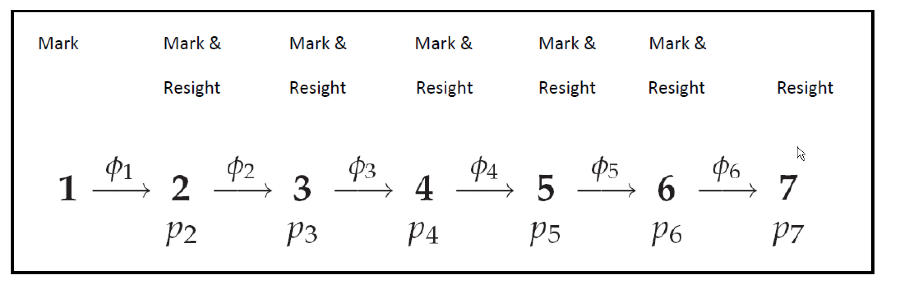
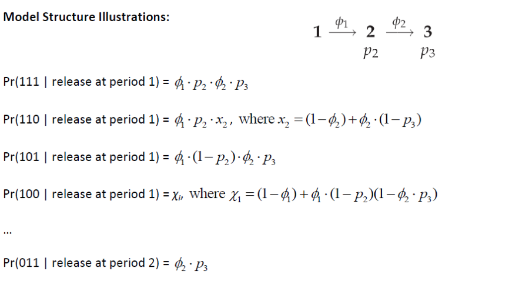
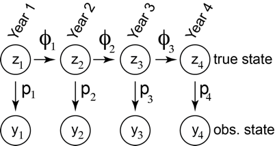

Week 12 Lecture
========================================================

** Read McCarthy and Masters (2005) for lab. We will be working with their data on the European dipper.

Today we are going to cover two types of models, mark-recapture models and occupancy models that have very different applications but share the same underlying principles.

Mark-recapture modeling
-------------------------

The basic idea behind mark-recapture is as follows: You catch an animal (hopefully lots of animals). You mark it. You come back at a later date and catch more animals. Some of these are animals with tags. Of those animals not recaptured, you do not know whether they are alive and present at the site but evaded capture, whether they died in the period between mark and recapture, or whether they survived but emigrated to another location. **Mark-recapture techniques at one site (absent strict site fidelity) cannot distinguish between permanent emigration and death**, and so we usually use the phrase \emph{‘apparent mortality’} to reflect the fact that some of the missing animals simply moved to another location. That said, repeated recapture events allow you to estimate how many individuals that remained at the site were simply not recaptured. (For example, if the capture history looks like 1001, you know the animal didn’t die, and you can estimate the probability of recapture conditional on presence.)

MARK is a very popular software for mark-recapture models that uses maximum likelihood. Since this is a Bayesian class, we will stick to Bayesian solutions to the classic mark-recapture problem.

##Cormack-Jolly-Seber

The CJS model assumes \emph{time dependent survival} and \emph{capture-specific detection probabilities}. (These are different because while an animal has to survive every year, detection or non-detection only occurs when there is an effort to recapture or re-sight animals. Thus, you may have a 10 year time series in which 4 recapture surveys were completed. You would, in the most general model then, have 9 probabilities for survival to estimate ($\phi$), but only 4 probabilities for detection ($p$).) 

Let’s say we have a 7 year time series, and we make an effort to re-sight animals in each year. The illustration below numbers the probability of re-sight according to the year, so the first re-sight attempt is made in Year 2, and is called $p_{2}$.

```{r echo=FALSE, fig.align='center', fig.cap='Diagram of mark-recapture model.', out.width='100%'}

```

```{r echo=FALSE, fig.align='center', fig.cap='Outcomes and their probabilities of the basic mark-recapture model.', out.width='100%'}

```

STOP: Look over these probabilities and make sure they make sense.

For example, the probability of surviving three years after marking before being recaptured (or resighted) in the fourth year is given by:

$$
\phi_{1}\phi_{2}\phi_{3}\phi_{4}(1-p_{1})(1-p_{2})(1-p_{3})p_{4}
$$

Mark-recapture model selection usually hinges around how to reduce the full number of parameters to something more estimable, for example, by assuming the detection probabilities are the same across capture attempts. Alternatively, you might model survival or capture probabilities as a function of covariates, such as

$$
logit(\phi_{i}) = \beta_{1} + \beta_{2} X_{i}
$$

Note that animals can become trap-happy or trap-shy, which means that catching them a second time can be a lot easier or more difficult than catching them the first time. There are dozens and dozens of papers dealing with these kinds of models. You can model either (or both) survival and capture probabilities as a function of time, which means that even with no other parameters, you are looking at four possible models: ($\phi(t),p(t)$), ($\phi(t),p(.)$), ($\phi(.),p(t)$), ($\phi(.),p(.)$), where I have used $.$ to represent no time dependence. 

How would you decide which model was best? We will get into model comparison methods in a few weeks.

McCarthy described two approaches to fitting mark recapture models in JAGS. The first is basically a brute force state-space model in which we explicitly model transitions between each year for each animal. The data required is the full matrix of 0s and 1s recording the capture history for each animal. The second approach is to model the entire capture history (for each animal) at once to work out the likelihood of obtaining that capture history. We will go through both approaches.

##Method #1: Brute force

The probability of individual $i$ being alive at time $t$ $(Z_{i,t}=1)$ conditional on having been alive at time $t-1$ is given by

$$
Z_{i,t} \sim Bern(Z_{i,t-1}\phi)
$$
The probability of re-sighting an animal is 

$$
Y_{i,t} \sim Bern(Z_{i,t}p_{i})
$$

Note that $Z_{i,t}$ is a latent state, knowledge of which is inferred only indirectly through $Y_{i,t}$, which is the data. The set up looks like

```{r echo=FALSE, fig.align='center', fig.cap='Transitions in a state-space model', out.width='100%'}

```

We have a lot of flexibility in modeling capture probabilities. At one extreme, we could model each capture probability separately, and at the other extreme we could assume a constant capture probability for the whole experiment. Somewhere in between these two extremes are models that assume capture probability is drawn from some distribution (this distribution would be governed by ‘hyperparameters’; this is an example of hierarchical modeling which we discussed a few weeks ago), or governed by some covariates (such a time of day, weather, etc.).

Exercise: What would some of these observation models (i.e. models for capture probability) look like?

##Method #2: Modeling the entire capture history

The idea behind this is as follows. For the entire period between marking and the last recapture, you know the animal is alive.  Between the last resighting and the end of the experiment, you don’t know whether the animal is still alive or not. So we divide up the recapture history into two periods, the first being the period in which we know the animal is alive (from initial marking until ), and the second in which we do not know whether the animal is alive or dead.

In the first period, you know that the animal survived $t_{1}$ years, and so the detection history of $d$ re-captures and $t_{1}-d$ non-captures:

$$
L_{1} = \phi^{t_{1}}p^{d}(1-p)^{t_{1}-d}
$$
Note that we have to include a term for survival probability; the fact that an animal lived for $t_{1}$ years is informative about that parameter.

In the second period, we have to add up all the various possible “paths” of non-detection and/or mortality. In this second period ($t_{2}$ years of non-detection), there are two possibilities: (1) it survived but went undetected for all $t_{2}$ years or (2) it survived and went undetected for $t < t_{2}$ years and then it died. The net result of this is a likelihood that looks like

$$
L_{2} = (1-\phi)\sum_{i=1}^{t_{2}}[\phi(1-p)]^{i-1}+[\phi(1-p)]^{t_{2}}
$$
where $\phi$ is the probability of survival and $p$ is the probability of detection. (You may need to write out a few terms to convince yourself of this.)

The joint likelihood of the entire time series is the product of $L_{1}$ and $L_{2}$.

The advantage to modeling the entire capture history in this way is that you have condensed the data down to three numbers for each mark-recapture history $t_{1}$, $d$, and $t_{2}$, so animals that share these metrics can be combined and the entire dataset, which might be quite large, can be greatly compressed for analysis.

##What other kind of models might you fit

There are almost an infinite variety of models you might fit to your data. You could build models that include

1) year-specific survival rates (either related to year itself, or to some environmental covariates that relate to inter-annual variability in survival)
2) capture rates that decline with the number of previous captures (once captured, twice shy?)
3) capture rates that depend on the field biologist setting and checking traps

etc.

Occupancy modelling
---------------------

Closely related to mark-recapture models are occupancy models.

Assume you have data from a field sampling program in which the presence or absence of a bird species is recorded along transects at different elevations and tree densities. You have one data point (Y=0 $\rightarrow$ absence, Y=1 $\rightarrow$ presence) for each transect. The basic model in this case would be a logistic model

$$
Y_{i} \sim Bern(p_{i}) \\
logit(p_{i}) = \alpha + \beta* \mbox{Elev}_{i} + \gamma*\mbox{Density}_{i}
$$
where I have assumed Elevation and Density as covariates.

Many models for habitat suitability look much like this. Implicitly we have assumed 100$\%$ detection rates, because we assume that our data reflect the true occupancy status. 

Let’s say that now we admit the possibility that we have imperfect detection, and sometimes fail to detect the target species when it is present. To manage this scenario, we need to add an “observation model”, and we need some additional information that would allow us to separate true absence from non-detection. What we need are **repeated surveys over some period of time that the population is closed to immigration and emigration**. (This is called a robust sampling design.) These repeat samples allow us to estimate the probability of non-detection when a species is present. We will assume that each transect is surveyed J times each breeding season, and we will assume that the presence of a species in the transect is fixed over that period of time. The observations are now not Bernoulli 0/1 but a Binomial draw that represents the number of times (out of $J$ surveys) that a species was recorded. The resulting model looks something like:

$$
Y_{i} \sim \mbox{Binom}(n=J,p=\mu_{i}) \\
\mu_{i} = Z_{i}*\phi_{i} \\
Z_{i} \sim \mbox{Bern}(p_{i}) \\
\mbox{logit}(p_{i}) = \alpha + \beta*\mbox{Elev}_{i}+\gamma*\mbox{Density}_{i}
$$
$Z_{i}$=True occupancy (0/1)

$\phi_{i}$=Probability of detection

$p_{i}$=Probability of occupancy

Note that we have introduced a latent unmeasured state variable $Z_{i}$ that is analogous to the latent state representing the status of an animal in a mark-recapture context. Also note that if $Y_{i} > 0$, then $\mu_{i} > 0$, which means that $Z_{i}$ must equal 1. Transects for which a species was sometimes detected, but not always detected, give us direct information on the probability of detection $\phi_{i}$. This gives us the ability to estimate the probability of occupancy for transects in which the species was never detected (but which it may occupy).

**Side note**: Repeated measurements during which time the population is “closed” is key. There are some attempts to model situations in which only a single survey is performed, but these require a bunch of other assumptions and constraints. By and large, these models require a sampling scheme in which repeated surveys are attempted.

Note that this is basically the site-occupancy model presented by Kery in Chapter 20. We will not have time to get into abundance models, but you can see the basic logic in extending this model to the abundance of animals counted at site  $i$ on occasion $j$ ($Y_{ij}$) as follows:

$$
Y_{ij} \sim \mbox{Binom}(N_{i},p_{ij}) \\
N_{i} \sim \mbox{Pois}(\lambda) \\
\mbox{logit}(p_{ij}) = \mbox{whatever}
$$
where the number of animals actually present at site $i$ ($N_{i}$) is drawn from a Poisson distribution that reflects the overall density of individuals in the landscape.

##Dynamic state-space models for meta-population dynamics

NB: My discussion here follows closely the paper by Royle and Kéry (2007).

In the discussion above, we assumed a totally closed population. **Meta-population models, in which we are interested in colonization and extinction dynamics of sites (or ‘patches’), explicitly include the possibility that a site’s occupancy status might change over time.** In these cases, we assume a sampling strategy in which site occupancy is allowed to change between ‘primary’ sampling periods (often, but not always, between years) but is assumed fixed at secondary sampling intervals (such as within a breeding season). The secondary sampling allows us to estimate the true probability of occupancy in each year, and changes in true occupancy status \emph{across} years gives us information on the metapopulation dynamics. Note that if we ignored detection failures, we would probably over-estimate the probabilities of extinction and recolonization, because a detection history of 101 (found, not found, found) would be interpreted as one extinction event followed by one colonization event. Allowing for detection failures, there emerges a second possibility, which is continuous occupation with a detection failure in year 2.

We model the true occupancy status of site  in year  (the process model) as

$$
Z_{i,t}|Z_{i,t-1} \sim \mbox{Bern}(Z_{i,t-1}\phi_{t-1}+(1-Z_{i,t-1})\gamma_{t-1})
$$
where

$$
\phi_{t-1} = \mbox{probability of patch survival in year t-1} \\
\gamma_{t-1} = \mbox{probability of patch recruitment in year t-1}
$$
The observation model for observation $j$ at site $i$ in year $t$ looks like

$$
Y_{j,i,t} \sim \mbox{Bern}(Z_{i,t}p_{t})
$$
Royle and Kery make an important point about the difference between finite sample estimators and population estimators (see ‘Finite sample estimation’ section on page 1816). In a conservation context this can be an important distinction. I encourage you to read that section carefully if this is likely to apply to your research.

