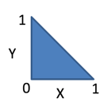
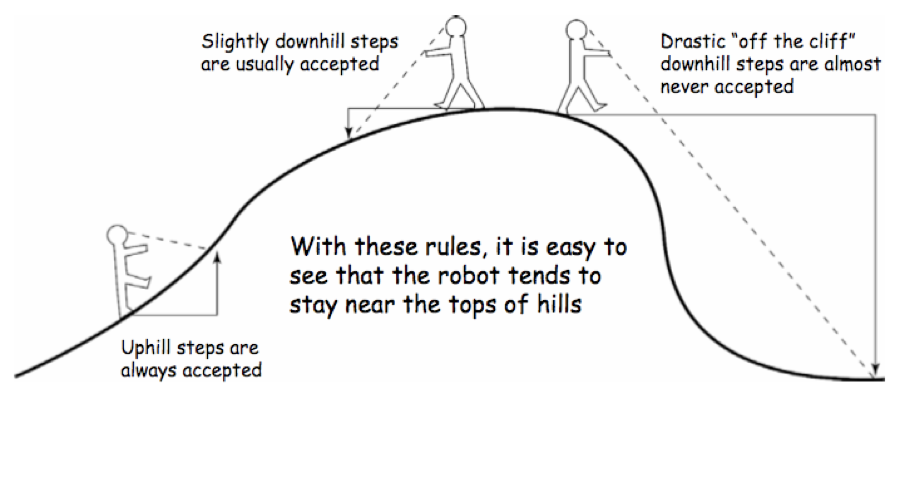
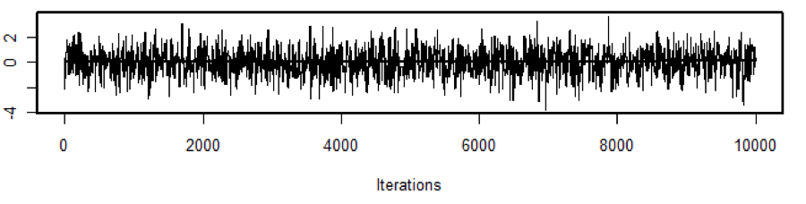
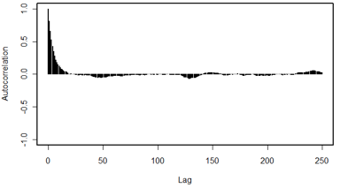

Week 5 Lecture
========================================================

Last week we talked about several applications of MC methods. This week, we are going to expand on these ideas to cover two additional, very important, applications:

1) Gibbs sampling
2) Metropolis / Metropolis-Hastings

Keep in mind that the point behind doing MC sampling is that it provides a mechanism for sampling from the posterior distribution. (Remember, the posterior distribution may have [in fact, usually has] no straightforward analytical form.) Last week we covered a class of non-iterative samplers that require us to have a candidate distribution that we could sample from. (They are non-iterative, because we could have drawn all N candidate values simultaneously. The accept-reject criteria for each sample was independent of the accept-reject decision made on the others.) 

The problem with these methods is that it is often very hard to come up with a good candidate distribution that is a good approximation to the target distribution (the closer the better – otherwise, we have a very inefficient algorithm) and which we can sample from. (In one-dimension, this is usually not an issue, the problems arise when you have multi-dimensional problems because candidate distributions for the joint PDF are harder to generate.) Another class of samplers, used more often in Bayesian statistics, is iterative samplers that (for the most part) rely on the generation of a “Markov chain”.

Before we get into MCMC, its worth thinking a bit more about what a Markov Chain is. A Markov Chain is a series of observations, each one dependent only on the last (or, in more complex examples, or a finite number of previous observations). At the end of the day, a Markov Chain is simply a string of numbers (or, equivalently, states), which we will denote $X^{t}$. So the state of the chain at $t=0$ is $X^{0}$, etc.

The easiest way to represent the allowed transitions in the chain is through a transition matrix 
$$
P = \begin{bmatrix}
p_{11} & p_{12} & p_{13}\\
p_{21} & p_{22} & p_{23}\\
p_{31} & p_{32} & p_{33}
\end{bmatrix}
$$
where $p_{12}$, for example, is the probability of making the transition between state 1 and state 2 in the chain.

Let’s say that we start the Markov Chain with an initial value of $X^{0} = 1$. What is the probability that we end up at state 3 after two time steps (i.e. that $X^{2} = 3$)?

To figure this out, we have to account for all possible Markov Chains that could have occurred between $t=0$ and $t=2$:

| Path        | $X^{0}$    | $X^{1}$      | $X^{2}$ | Probability   |
| ------------------- |:--------:|:---------:|:---------:| :---------:|
| #1          |    1  |    1    |      3    | $p_{11}p_{13} |
| #2          |   1   |     2   |      3    |  $p_{12}p_{23} |
| #3          |    1  |    3     |      3    | $p_{13}p_{33} |

Therefore, the probability of being in state 3 by $t=2$ is the sum of these three probabilities: $p_{11}p_{13}+p_{12}p_{23}+p_{13}p_{33}$.

Note that the transition probabilities are independent (that’s why the total probability is just the product of the two individual transition probabilities). The “Markov”ness comes about because the probability of transitioning from State 1 to State 3 is independent of the path that got you to State 1 in the first place, and so the probability of going to State 3 depends only on the fact that you are currently in State 1.

If we let the chain run long enough, you can see that we will eventually reach all the states. (None of the states are absorbing states, so you have a finite probability of moving from each state to every other state – such chains are called “ergodic”. I won’t get into any proofs or formal math here, but some vocabulary will be helpful in reading the literature on MCMC.) Not only will you reach all of the states, but the long-run probability of being in each state will eventually converge to a distribution which is governed by the transition matrix and is independent of the starting point ($X^{0}$).

(Note that I am presenting Markov Chains in the context of discrete states, but the same logic holds when we extend this to continuous states whose transitions are described by a probability density.)

Mathematically, we would say that the \emph{conditional} probability of state $X^{t+1}$ is given by the following

$$
X^{t+1} \sim p_{trans}(x|X^{t} = x^{t})
$$
that is, that the probability is conditional on the value of the state at time $t$. The important element of this is that even though the individual states of the chain are conditional on the preceding states, the marginal (unconditional) distribution of the states will converge to a unique stationary distribution that is independent of the starting values.

From the Bayesian perspective, our goal is to choose a transition distribution that will generate a sequence of distributions for the parameters of our model whose unique stationary distribution is the joint posterior distribution of interest. (Some of this will be clearer as we go through more applied examples…)

Now that we have the basic idea, let’s discuss Gibbs sampling, which is one of the most widely used algorithms for generating a Markov Chain.

Gibbs Sampling
-------------------

Gibbs sampling is a method for obtaining a multidimensional Markov Chain by splitting a vector of random variables into univariate draws from conditional distributions. A simple example would be a three-dimensional Markov Chain for parameters $(\theta_{1},\theta_{2},\theta_{3})$. We may have no easy way to sample from this joint probability density, but we might know all the conditional probability distributions:

$$
p(\theta_{1}|\theta_{2},\theta_{3},y) \\ 
p(\theta_{2}|\theta_{1},\theta_{3},y) \\ 
p(\theta_{3}|\theta_{1},\theta_{2},y)
$$

where $y$ is the data.

The basic strategy is as follows:

1. Choose arbitrary starting values for $(\theta_{1},\theta_{2},\theta_{3})$, which we will call $(\theta_{1}^{(0)},\theta_{2}^{(0)},\theta_{3}^{(0)})$.
2. Iterate through each parameter, drawing from its conditional distribution for the next iteration of the chain, conditioning on the most recent values for each parameter

$$
\theta_{1}^{(1)} \sim p(\theta_{1}|\theta_{2}^{(0)},\theta_{3}^{(0)},y) \\
\theta_{2}^{(1)} \sim p(\theta_{2}|\theta_{1}^{(1)},\theta_{3}^{(0)},y) \\
\theta_{3}^{(1)} \sim p(\theta_{3}|\theta_{1}^{(1)},\theta_{2}^{(1)},y) \\
\theta_{1}^{(2)} \sim p(\theta_{1}|\theta_{2}^{(1)},\theta_{3}^{(1)},y)
$$
and so forth.

3. Continue iterating through the chain a large number of times, until the chain has converged (we haven’t yet discussed how we would test convergence yet).

EXERCISE: We're going to practice this a bit using a simple example inspired by our earlier work on the uniform triangle distribution. Earlier we drew samples from a uniform triangle distribution using Rejection Sampling. Here we are going to use Gibbs Sampling. First, you will need to work out the two conditional probabilities $p(x|y)$ and  $p(y|x)$. You could of course use Bayes Theorem to calculate this

```{r echo=FALSE, fig.align='center', fig.cap='Uniform triangle distribution', out.width='25%'}

```

$$
p(x|y) = p(x,y)/p(y)
$$
and

$$
p(y|x) = p(x,y)/p(x)
$$

since you already worked out the marginal probabilities $p(x)$ and $p(y)$ but in this case its easier just to reason through it. In other words, if you knew $x$, what would be the possible range of $y$, and vice versa? (Here we are restricting the range to $x \in (0,1)$ and $y \in (0,1)$, which is slightly different from our original example, but it should be straightforward to work out the two marginal probabilities involved here.)

Once you have the conditional probabilities, Gibbs sampling proceeds as follows ($k$ is the variable to track the number of iterations):

(1) Choose legitimate starting values $(x_{0},y_{0})$.
(2) Sample $x_{1}$ from $p(x_{1}|y_{0})$.
(3) Sample $y_{1}$ from $p(y_{1}|x_{1})$.
(4) $k \rightarrow k+1$, go back to step 2

When you have tried a large number of samples $k$, plot your bivariate samples - how do they look? (In other words, make a scatterplot of the sampled $(x,y)$ pairs.)

Now histogram just the $x$ values. This is the **marginal probability density** $p(x)$. Does it make sense why? Think back to the exercise we did with graph paper. If we have bivariate samples from $(x,y)$ and we simply tally up all the samples for a certain x-value (irrespective of the y values involved), we have "marginalized out" $y$ to create $p(x)$. 

When we do modelling in JAGS, we will do this automatically. In fact, the posterior summaries provided by JAGS and the related R packages automatically provide marginal posterior summaries, and they do that by summarizing the draws for one variables ignoring the values for all the other variables. (I think of this as taking one column from the sims.matrix.)

Metropolis algorithm
-------------------

The Metropolis algorithm is widely used, and can be described by the following steps, which describe the transition from one state $x$ to another state $x^{\prime}$ as follows:

1) Assuming we are currently in a state $x$, a “candidate” $x^*$ is proposed according to some symmetric probability $S(x,x^*)$ (symmetric means that $S(x,x^*)=S(x^*,x)$).

(Note that Metropolis-Hastings is the same as Metropolis with the added flexibility of assymetric jumps. We won’t cover M-H specifically, except to to note that the terms are often used interchangeably because symmetric jumps are so common.)

2) This candidate, $x^*$, is accepted as the next state with probability

$$
\mbox{min}[1,\pi(x^*)/\pi(x)]
$$

where $\pi(x)$ is the probability density associated with $x$, and likewise, $\pi(x^*)$ is the probability density associated with $x^*$. If $x^*$ is accepted, then $x^{t+1}=x^{*}$. If $x^*$ is rejected, then $x^{t+1} = x^{t}$. (In other words, if you reject the candidate state, then you stay put.)

Note that you only need to be able to evaluate the ratio $\pi(x^*)/\pi(x)$, so you don’t need to worry about, or even know, the normalizing constants associated with the function $\pi$. The proposal distribution $S(x,x^*)$ is critical here because it controls how quickly or slowly the chain samples the space, and how quickly the chain converges. One popular proposal distribution is that which would be associated with an unbiased random walk.

Some terminology here to navigate if you are applying the Metropolis algorithm to a multivariate problem:
 
\emph{Single-variable Metropolis}: Proposals only change one component of $x$, and updates to each component are applied in sequence.

\emph{Multivariate Metropolis}: Proposals change all components of $x$ simultaneously. For example, you might generate proposals of the form

$$
\begin{pmatrix}
\theta_{1}^{proposed}\\
\theta_{2}^{proposed}\\
\end{pmatrix} \sim N \left(
\begin{pmatrix}
0\\
0\\
\end{pmatrix},
\begin{pmatrix}
1 & 0.5\\
0.5 & 1\\
\end{pmatrix}\right)
$$
A nice visual of M-H (courtesy of Paul Lewis) is given here

```{r echo=FALSE, fig.align='center', fig.cap='Visualizing Metropolis-Hastings movement rules. Source: Paul Lewis', out.width='100%'}

```

You can see that, under the movement “rules” of M-H, the robot tends to spend the most time near the top of the hill.

(FYI: Gibbs sampling is a special case of M-H in which the proposed value of the parameter (the one drawn from the conditional) is always accepted.)

The Messy reality = Hybrid of M-H and Gibbs
------------------------------------------

JAGS and related software use a messy combination strategy that combines Gibbs sampling and M-H sampling. The essential idea is that you may find yourself with a suite of parameters, some of which have known conditional relationships, and others which do not. In these cases, you can use Gibbs where you can, and M-H where you can’t use Gibbs. (Why bother with Gibbs at all? Remember that Gibbs has an acceptance ratio of 1, so its more efficient than M-H.) This is what is hidden under the hood of JAGS. Note that JAGS always starts off with “adaptive sampling” (in the GUI, you can see this happening, but from R this is hidden…). This is the period of time when JAGS is trying to tune the M-H proposals to get a target acceptance ratio.

Convergence
------------------------------------------

One of the big challenges in doing MCMC is assessing whether your chains have converged to their unique stationary distribution. 

How do we assess convergence?

Its often easy to see that chains have \emph{not} converged – we usually do this visually by starting with three “overdispersed” sets of starting values and simply plotting the chains to see whether they are indistinguishable after some period of time. Since we are only interested in the stationary behavior and not the initial transient behavior, we discard the beginning of each chain so our posterior distribution is only derived from the stationary portion of the chain. We call the portion of the chain discarded the “burn in”. (Papers will report this number, as in “we used a burn in of 1,000 iterations…” and so forth.)

Another aspect to MCMC chain assessment is looking at how well they are “mixing”, which is just to ask how well they are sampling the posterior distribution. Warning signs that your chains are not mixing well is when the chains get stuck in certain regions of parameter space (in these cases, the posterior histograms tends to be multimodal as well.)

(You want the chains to look like white noise…)

```{r echo=FALSE, fig.align='center', fig.cap='Samples from an MCMC sampler that has converged.', out.width='100%'}

```

The autocorrelation function can provide additional information.

```{r echo=FALSE, fig.align='center', fig.cap='Autocorrelation function from MCMC samples.', out.width='100%'}

```

Sometimes, to save storage, you may decide to subsample, or “thin” the chain and store only every other draw (or every 3rd, or 10th, etc.). The autocorrelation function can help you decide how spaced the draws would have to be in order to be independent. However, note that there is no need to thin the chains unless memory is an issue. Its better to keep all the draws if you can.

However, when chains converge slowly, or meander over parameter space, its often hard to prove that the chains have converged (or, more precisely, to say that you cannot reject the null hypothesis that the three chains come from the same distribution). (Meandering over parameter space is annoying, but it doesn’t necessarily mean that your script doesn’t work or the problem cannot be solved. Sometimes the chains just mix slowly, and while there are tricks to try and make them mix more quickly, sometimes you just have to run really long chains to get a good picture for the posterior distribution. 


There are many ways to formally test for convergence; we will discuss this in Week 9. For now, we’ll just visually assess the chains for convergence, which is what people actually do right up until a manuscript reviewer asks for something more rigorous. (But much better not to make assumptions that might cause for an embarrassing retraction following review...)

Bayesian change point example
----------------------------

The following is based on the Bayesian change point example by Murali Haran.

Consider the following simple changepoint example: You have Poisson draws and you expect that the Poisson parameter has changed at some point in the time series, so that

$$
Y_{i}|k,\theta,\lambda \sim Pois(\theta) \mbox{for i=1,...,k}
$$

$$
Y_{i}|k,\theta,\lambda \sim Pois(\lambda) \mbox{for i=k+1,...,n}
$$

We assume the following prior distributions for $\theta$ and $\lambda$

$$
\theta \sim Gamma(0.5,3)
$$
$$
\lambda \sim Gamma(0.5,3)
$$
$$
k \sim Unif(1,n)
$$

We will assume the following parameterization for Gamma

$$
Gamma(\alpha,\beta) = \frac{1}{\Gamma(\alpha)\beta^{\alpha}}x^{\alpha-1}e^{-x/\beta}
$$

We want to use the data $Y$ to make inference about the following three dimensional posterior 

$$
f(\theta,\lambda,k|Y) \propto \left(\prod_{i=1}^{k}\frac{\theta^{Y_{i}}e^{-\theta}}{Y_{i}!}\right) \times \left(\prod_{i=k+1}^{n}\frac{\lambda^{Y_{i}}e^{-\lambda}}{Y_{i}!}\right) \times \frac{1}{\Gamma(0.5)3^{0.5}}\theta^{-0.5}e^{-\theta/3} \times \frac{1}{\Gamma(0.5)3^{0.5}}\lambda^{-0.5}e^{-\lambda/3} \times \frac{1}{n}
$$

To do Gibbs sampling we need to sample from the posterior for each parameter conditional on the other parameters (and the data). Let's start with the conditional posterior for k. We use the following fact

$$
f(k|\theta,\lambda,Y)=\frac{f(\theta,\lambda,k|Y)}{f(\theta,\lambda|Y)}
$$

which means that

$$
f(k|\theta,\lambda,Y) \propto f(\theta,\lambda,k|Y)
$$

where on the right hand side, we only need to worry about the terms that actually involve k. In this case

$$
f(k|\theta,\lambda,Y) \propto \left(\prod_{i=1}^{k}\frac{\theta^{Y_{i}}e^{-\theta}}{Y_{i}!}\right) \left( \prod_{i=k+1}^{n}\frac{\lambda^{Y_{i}}e^{-\lambda}}{Y_{i}!}\right)
$$

In fact, we can simplify this a bit further

$$
f(k|\theta,\lambda,Y) \propto \left(\prod_{i=1}^{k}\theta^{Y_{i}}e^{-\theta}\right) \left(\prod_{i=k+1}^{n}\lambda^{Y_{i}}e^{-\lambda}\right)
$$

because the denominators of the two products equal $\prod_{i=1}^{n}Y_{i}!$ which does not involve k.

What about $\theta$? Using the same idea as above

$$
f(\theta|\lambda,k,Y)=\frac{f(\theta,\lambda,k|Y)}{f(\lambda,k|Y)}
$$

and

$$
f(\theta|\lambda,k,Y) \propto f(\theta,\lambda,k|Y)
$$

where again we only need the parts of the right hand side that involve $\theta$

$$
f(\theta|\lambda,k,Y) \propto \left(\prod_{i=1}^{k}\theta^{Y_{i}}e^{-\theta}\right) \times \theta^{-0.5}e^{-\theta/3} 
$$

What about $\lambda$? Using the same idea as above

$$
f(\lambda|\theta,k,Y)=\frac{f(\lambda,\theta,k|Y)}{f(\theta,k|Y)}
$$

and

$$
f(\lambda|\theta,k,Y) \propto f(\lambda,\theta,k|Y)
$$

where again we only need the parts of the right hand side that involve $\lambda$

$$
f(\lambda|\theta,k,Y) \propto \left(\prod_{i=k+1}^{n}\lambda^{Y_{i}}e^{-\lambda}\right) \times \lambda^{-0.5}e^{-\lambda/3} 
$$

So, how does Gibb's sampling actually work in this case?

First we pick starting values (at random, but within the support of the prior) for $\lambda$, $\theta$, and $k$. We call these $\lambda^{(0)}$, $\theta^{(0)}$, and $k^{(0)}$. We then sample from each conditional posterior at a time:

$$
k^{(1)} \sim \left(\prod_{i=1}^{k^{(0)}}(\theta^{(0)})^{Y_{i}}e^{-\theta^{(0)}}\right) \left(\prod_{i=k^{(0)}+1}^{n}(\lambda^{(0)})^{Y_{i}}e^{-\lambda^{(0)}}\right)
$$

then 

$$
\theta^{(1)} \sim \left(\prod_{i=1}^{k^{(1)}}(\theta^{(0)})^{Y_{i}}e^{-\theta^{(0)}}\right) \times (\theta^{(0)})^{-0.5}e^{-\theta^{(0)}/3} 
$$

Which can simplify to

$$
\theta^{(1)} \sim Gamma(\sum_{i=1}^{k^{(1)}}Y_{i}+0.5,\frac{3}{3k^{(1)}+1})
$$

because the Gamma is conjugate to the Poisson.

Finally, 

$$
\lambda^{(1)} \sim \left(\prod_{i=k^{(1)}+1}^{n}(\lambda^{(0)})^{Y_{i}}e^{-\lambda^{(0)}}\right) \times (\lambda^{(0)})^{-0.5}e^{-\lambda^{(0)}/3} 
$$

Likewise...

$$
\lambda^{(1)} \sim Gamma(\sum_{i=k^{(1)}+1}^{n}Y_{i}+0.5,\frac{3}{3(n-k^{(1)})+1})
$$

Note that while the posteriors for $\theta$ and $\lambda$ have well-known forms because of conjugacy, the conditional posterior for k does not have a standard PDF and we only know its PDF up to a proportion. That's OK, though, because we can use any of the tools have have learned to sample from PDFs that are not "built-into-R". What we have done is break apart a complex 3-dimensional posterior into three one-dimensional posteriors. Often, these conditional posteriors are easy to write down because you've used conjugate priors that have an analytically tractable posterior (as with $\theta$ and $\lambda$). In this case, the conditional posterior for k cannot be written in an easy form, so we have to use some other method of sampling *inside* the Gibbs loop. See Gelfand 2000 Section 2.4. Notice that when the conditional posterior take a non-standard form, we can employ any of the tools we have learned, including rejection sampling, importance sampling, or Metropolis-Hastings. The last of these is quite a common approach, and it is called "Metropolis-within-Gibbs". However, there are no cookbook recipes for doing this, you (as the modeller) have to choose among the tools to find one that works for your case.) The next round of draws would look like

$$
k^{(2)} \sim \left(\prod_{i=1}^{k^{(1)}}(\theta^{(1)})^{Y_{i}}e^{-\theta^{(1)}}\right) \left(\prod_{i=k^{(1)}+1}^{n}(\lambda^{(1)})^{Y_{i}}e^{-\lambda^{(1)}}\right)
$$


$$
\theta^{(2)} \sim \left(\prod_{i=1}^{k^{(2)}}(\theta^{(1)})^{Y_{i}}e^{-\theta^{(1)}}\right) \times (\theta^{(1)})^{-0.5}e^{-\theta^{(1)}/3} 
$$

$$
\lambda^{(2)} \sim \left(\prod_{i=k^{(2)}+1}^{n}(\lambda^{(1)})^{Y_{i}}e^{-\lambda^{(1)}}\right) \times (\lambda^{(1)})^{-0.5}e^{-\lambda^{(1)}/3} 
$$

We then repeat this process the draw $\lambda^{(3)}$, $\theta^{(3)}$, and $k^{(3)}$ etc.

##Hierarchical model

The full hierachical model originally posed by Haran includes a prior on one of the parameters for the Gamma prior on $\theta$ and $\lambda$. In other words, we postulate a prior distribution for $\theta$ and $\lambda$, but we say that we don't know what the prior distribution should be exactly, and so we put a prior distribution on one of its parameters. Specifically,

$$
\theta|b_{1} \sim Gamma(0.5, b_{1})
$$
$$
\lambda|b_{2} \sim Gamma(0.5, b_{2})
$$
$$
b_{1} \sim Gamma(5,5)
$$
$$
b_{2} \sim Gamma(5,5)
$$
$$
k \sim Unif(1,...,n)
$$

These "priors of priors" ($b_{1}$ and $b_{2}$) are called hyperpriors. Note that I have replaced $c_{1}$, $c_{2}$, $d_{1}$, and $d_{2}$ from Haran with the number 5, which is arbitrary but I wanted to make it clear what was a fixed number and what was a parameter. We will come back to these when we discuss hierarchical models in Week #14. For now, I'll simply say that as each step of the Gibbs sampling, you need to sample from all the terms that include the parameter of interest. Whereas in the non-hierarchical example, we had three parameters, now we have five parameters that we need to iteratively sample from.


