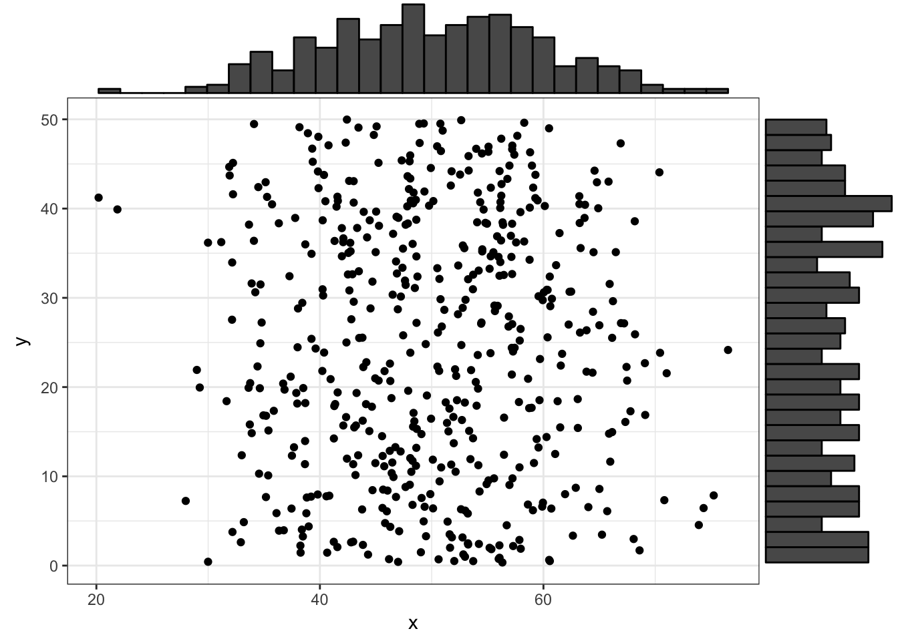

Week 1 Lab
========================================================


First, a warm up: You were given some graph paper, which we are going to use to practice some of the ideas from this week in cases where we don't have any parametric equations to deal with. I want you to put 100 points randomly on the grid. Now that you have your dataset (which will be unique to you), I want you to answer the following questions about your empirical dataset (not the average dataset you might have obtained). What is P(X=3)? What is P(Y=1)? What is P(X=3,Y=1)? What is P(X=3|Y=1)? Which of these questions are asking about the marginal probability? Joint probability? Conditional probability? Why might it be that $P(X=3,Y=1) \neq P(X=3) \times P(Y=1)$?

**Exercise #1**: OK, now that we're limbered up in the ways of joint, marginal, and conditional probabilities, let’s say you have two independent variables X and Y with the following probability distributions

$$
g(X)=\frac{2}{X^{3}} \space \space \space \mbox{ for } 1\leq X \leq \infty
$$

and

$$
h(Y)=\frac{3}{Y^{4}} \space \space \space \mbox{ for } 1\leq Y \leq \infty
$$

What is the joint probability distribution of (X,Y)?

Show that $P(X\leq Y) = 2/5$.

**Exercise #2**: Next we’ll work through some more complex cases, all in the name of trying to give you some intuition on how these multivariate distributions work.

In each of the following three cases, find the (1) joint distribution $P(X,Y)$, the two marginal distributions $P(X)$ and $P(Y)$ (2 and 3), and (4) determine if X and Y are independent.

Case #1: (X,Y) are uniformly distributed on the square 

$$
-6 \leq X \leq 6 \\
-6 \leq Y \leq 6
$$

Case #2: (X,Y) are uniformly distributed on the triangle 

$$
Y \leq X \leq 6 \\
-6 \leq Y \leq X
$$

Case #3: (X,Y) are uniformly distributed on the circle 

$$
X^2+Y^2 \leq 36
$$
Once you have worked this out analytically, we’ll try sampling from these distributions, and plotting the marginal probabilities. How you might sample from these distributions? 

<span style="color: blueviolet;">Why would it be wrong to sample from the uniform for X and then sample from the conditional for Y?</span>

Write a function to sample from these three joint distributions, and draw 1000 values from the joint distribution. Plot the values, and put the marginal histograms on the X and Y axes. There are many ways to include the marginal histograms. I did a quick google search and found some code that would work (which uses the R package ‘ggExtra’). There is probably a better way; I’ll be interested to see what you all come up with.


```r
df1 <- data.frame(x = rnorm(500, 50, 10), y = runif(500, 0, 50))
p1 <- ggplot(df1, aes(x, y)) + geom_point() + theme_bw()
ggMarginal(p1, type = "histogram")
```



