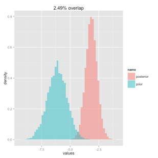

Week 10 Lecture
========================================================

This week we’ll take some time to discuss the messy, annoying computational details of doing Bayesian analyses. Before launching into this, its worth stepping back and reviewing a bit about Analysis of Variance, since the same ideas are going to be useful to us today.

Let’s say I have Normally distributed data on heights and I have three groups of individuals; I may want to ask whether these groups are different in height (on average). At first blush, I could simply take the average height in each group and compare them to each other, but this isn’t a good test. Why? Because if there is any variability in heights, then I do not know whether these group means are different because of random sampling error (i.e. I took a sample from each group and my sample may not be representative of the underlying population because there is some variance and maybe my sample has a few smaller individuals, etc.), or whether they are different because the groups really are fundamentally different in height. This is what we have to decide using the data we have. We do this by computing within-group variance using two methods.

Method #1: The simplest way of estimating within group variance is just to calculate it. In other words, calculate the variance for each group individually. If we have 3 groups, we now have 3 estimates of within group variance. To get an average estimate of within-group variance, we can just average those estimates together. More formally:

$$
\sigma^{2} = \frac{1}{m}\sum_{j=1}^{m}(\mbox{variance in group j})
$$
This works as an estimate of within-group variance even if the groups are different from one another. We could have a group of very tall individuals and a group of shorter individuals, but we could still estimate within-group variance by looking at the variation within each group and then averaging them together.

If the groups are **not** different (i.e., under $H_{0}$), then all the individuals sampled really do come from the same underlying population, regardless of group, and this gives us a second method of estimating within-group standard deviation. Recall that the Central Limit Theorem states that the variance in the **mean** is related to the variance in the data as

$$
\sigma^{2}_{\bar{Y}} = \frac{\sigma^{2}}{n}
$$
More samples ($n$) means we have a more precise (smaller $\sigma_{\bar{Y}}$) estimate of the mean $\bar{Y}$. We can flip this around to say 

$$
\sigma^{2} = n\sigma^{2}_{\bar{Y}}
$$
This says that if we know the variance among the MEANS we can use this to estimate the within-group variance. This only works when all the comes come from the same distribution. When doing ANOVA, we compare these two measures of within-sample variance to TEST whether the samples in different groups come from the same population. But the basic underlying idea, that we have variation within each group, and variance between groups, and that variance between groups can be used to estimate variance within groups (under $H_{0}$) is an idea we will need to use again in the context of chain convergence.

##Convergence

When we talk about a Bayesian model converging, we usually mean that our posterior distributions have adequately sampled the (correct) posterior distribution, and that we have enough samples from that posterior distribution to precisely estimate the parameters of our model. There are many metrics that we might use to assess our MCMC chains but they generally fall into two categories.

1) Estimates of Monte Carlo error: Monte Carlo error refers to the uncertainty in our parameter estimates that stems from having a finite number of samples from the posterior.

2) Testing convergence: $\hat{R}$ and $n_{eff}$

Before getting further, I want to make sure that everyone understands the distinction between two types of error. This is best illustrated with an example. Lets say that I have a simple binomial model

$$
Y_{i} \sim \mbox{Binom}(N,\theta)
$$
The posterior distribution $\theta|Y_{i}$ will have some "spread", as is easily seen by a histogram of the posterior samples, and the standard deviation of the posterior samples is a measure of that uncertainty. As long as we have adequately sampled the posterior distribution, that standard deviation will be insensitive to sample size. In other words, we can run our chains forever and that spread of the posterior distribution won’t change, because that spread reflects the "true" uncertainty about the parameter based on the prior and the data available. The parameter estimate we will report in the paper (i.e. the quantity of interest) will usually be the mean or median of that distribution, and we will refer to this measure of central tendency as $\hat{\theta}$. If we use the posterior mean as our measure of central tendency, then 

$$
\hat{\theta} = E[\theta|Y_{i}]
$$
Unlike the standard deviation of the samples for $\theta|Y_{i}$, our uncertainty regarding $\hat{\theta}$  (which we call the Monte Carlo standard error) **is** sensitive to sample size. As we collect more samples, we will more precisely estimate $\hat{\theta}$, and our uncertainty about  will decrease. This situation is analogous to the difference between the standard deviation of a distribution, and the standard deviation of the mean of a distribution, the latter of which we refer to as the standard error (of the mean).

In most applied applications of Bayesian modelling, Monte Carlo standard errors are not of interest and will be far smaller than the standard deviation of the posterior. In other words, given the Binomial model just discussion, you would report in your paper "$\hat{\theta}=$3.5 (2.1,4.7)". You would not need to specify the posterior mean to more digits "$\hat{\theta}=$3.547834 (2.1,4.7)" because the extra precision is made irrelevant because of the spread of the posterior. Technically, you should also report the uncertainty associated with the estimate of the posterior mean (in other words, how well do you know that the mean is 3.5 and not 3.4 or 3.6) but this is not usually done in the manuscript, rather the error of the mean is usually included in a table (such as in the summary table produced by JAGS).

[Keep in mind that we can ask about the MCSE for any function of any parameter, such as a function $\widehat{g(\theta)}$.]

**OK, now we know what Monte Carlo standard errors are, but how do we calculate them?**

If the N samples were all independent, then we could easily calculate the MCSE by just using the Central Limit Theorem.

$$
\mbox{MCSE} = \sqrt{\frac{s^2}{N}} = \sqrt{\frac{\frac{1}{N-1}\sum_{i=1}^{N}(g(\theta_{i})-\overline{g(\theta_{i})})^{2}}{N}} = \frac{SD(g(\theta_{i}))}{\sqrt{N}}
$$
However, the samples are not usually independent, and in fact, Markov Chain samples can be highly autocorrelated. Therefore, we use the \emph{other} way of calculating the MCSE, which is to divide up our chain into $m$ batches of length $n$ ($N=mn$); while the individual draws may be highly correlated, we hope that batches of draws will be independent. (There are many ways to estimate the Markov Chain standard error but here I am describing the **batch means** method.) 

Now we can write 

$$
s^{2} = \frac{n}{m-1}\sum_{j=1}^{m}(\overline{\theta_{. j}}-\overline{\theta_{..}})^{2}
$$
without concern for the autocorrelation of individual samples. 

##Testing for convergence

Theory cannot tell us how long it will take to get our chains to converge. So far we’ve done simple examples that converge after only a few thousand iterations, and take only seconds to run. In practice, JAGS may take days or even weeks of processing, even with parallel chains, to converge. You may never get it to converge. 

If you are writing your own samplers from scratch, there are a lot of issues you have to deal with, but using JAGS, your problems are fewer. One of the few controls you have on the actual posterior is to decide how much to thin the chains. It is always better to keep everything. However, if you have to run millions of chains, you are usually better off only storing some fraction of those samples. You can thin out by selection one out of every two, one out of ten, etc. This keeps the size of the MCMC output reasonable even if the chains are very long, and because the samples are often highly correlated, it involves minimal information loss.

How do we assess convergence? Many Bayesian practitioners would argue the best approach is simply to compare the performance of multiple chains. With parallel processing, this often doesn’t take any longer than running a single chain, especially so because even basic desktop computers have multiple cores. The idea is that if multiple chains converge on the same distribution, then you must have found the correct distribution. However, Geyer (in Brooks et al. 2011) cautions about pseudo-convergence. What is pseudo-convergence? Consider a situation in which the distribution you are trying to sample from (but don’t know) has a 99.9% probability of being Unif(0,1) and a 0.1% probability of being Unif(1000000,1000001). Under these circumstances, assuming a fairly typical jump proposal such as N(0,1), you might start all of your samplers so that they end up sampling only the portion that is Unif(0,1). For a chain of any reasonable length, you might never propose a jump to the second portion of the distribution Unif(1000000,1000001), and so your chains will appear to converge on Unif(0,1) and you would have no clue that there was in fact support along some other interval. Running multiple chains will not have helped identify convergence because, in essence, they were not ‘overdispersed’. **The problem is that without knowing the distribution, you have no way of knowing what constitutes overdispersed**, so you have no way of choosing starting values that are guaranteed to sample the entire space. As noted by Geyer, this is a problem with all “black box” samplers.

Gelman and Shirley (in Brooks et al. 2011) are less nihilistic in their advice on convergence, and they offer some more practical suggestions. The most important suggestion in to **simulate fake data** and fit the model to convince yourself that a) the model works as expected and b) that the posterior intervals are sensible (i.e., 50% of the 50% posterior intervals should contain the true value). 

*	Whenever possible, its critical to use fake data to confirm that your code works. This is well worth the time invested.
*	I also like Gelman and Shirley’s (slightly cheeky) advice to run the chains from the point of submission until the reviews come in. It’s actually kind of brilliant.

##Gelman-Rubin statistic

There are many ways to try and assess whether a chain has converged. Of course, we never know if this is pseudo-convergence, but this is an unknown unknown that non-statisticians don’t usually obsess over (unless, of course, the posterior is pathological or the chains are very slow to mix…). Here I will present just one formal test, the Gelman-Rubin diagnostic, which I like because it’s quite intuitive and is a direct analog to an analysis of variance. (It is also well-known, and likely to pass through peer review without a second glance…) The G-R statistic requires that you run multiple chains starting with “overdispersed” starting values (in practice, people just pick widely different starting values; more correctly, I would fit your model, draw overdispersed values from those posteriors, and run it again with those starting values). If you have  chains, each of length , then the G-R statistic is

$$
B=\frac{n}{m-1}\sum_{j=1}^{m}(\overline{\theta_{. j}}-\overline{\theta_{..}})^{2} \\
W=\frac{1}{m}\sum_{j=1}^{m}\left[\frac{1}{n-1}\sum_{i=1}^{n}(\overline{\theta_{ij}}-\overline{\theta_{.j}})^{2}\right]
$$
where $\theta_{ij}$ is the ith sample from the jth chain, $\overline{\theta_{.j}}$ is the average over the jth chain, and $\theta_{..}$ is the global average (over all samples in all chains). 

Using these values, we can estimate the marginal posterior variance of $\theta$

$$
\widehat{Var(\theta|y)} = \frac{n-1}{n}W + \frac{1}{n}B
$$
which can be used to calculate the Gelman-Rubin statistic

$$
\hat{R} = \sqrt{\frac{\widehat{Var(\theta|y)}}{W}}
$$
If $\hat{R} \approx 1$, at least <1.1, then we can be fairly confident that the chains have converged.

To gain a little intuition for this statistic, consider the case of very large  (which is always the case, since the chains are always long)

$$
\hat{R}_{\mbox{n large}} \approx \sqrt{B/n}{W}}
$$
which is basically like comparing two estimates of the variance, one derived from the variance between chains (divided by n, think back to how we got SE from SD!) and one derived from the variance within a chain. 

The effective sample size $n_{eff}$ is a related measure to $\hat{R}$.

##The take away: What should we be checking after we run our models

Step 1: The first step in fitting any kind of “mission-critical” model is to simulate data and to ensure that you can recover your parameter values. If some parameters are recoverable, but others are not, this might suggest a reworking of the model to eliminate non-identifiable parameters.

Step 2: Once you’ve run your model (on simulated data, as in Step 1, or later with real data), you will want to check convergence.

a)	Visual inspection of the chains
b)	Look at $\hat{R}$ for all parameters, esp. those of key interest

Step 3: Do a bivariate scatterplot of your key parameters. In other words, make scatterplots which plots the samples of each parameter against the samples from the other parameter. Doing so will highlight parameters that might be “trading off” (i.e. large values of one parameter are associated with small values of another parameters, etc.). If parameters are trading off, it may be because there is some combination of these that is identifiable (the product or the ratio) but that the parameters individually are not identifiable. If you have parameters that are trading off or whose scatterplots show non-independence between parameters, you will need to summarize your posterior distribution by a confidence envelop rather than through the two marginal posterior distributions, since the latter (while not strictly incorrect) hides the inherent correlations between the two parameters and may lead you to over- or underestimate uncertainty (similar to Bolker’s likelihood slices vs likelihood profiles in Biometry).

Step 4: Plot prior-posterior overlap for each key parameter of interest. Too much overlap strongly suggests that your data are simply not that informative about a certain parameter, which is why your posterior looks very similar to the prior.

Some code to do that and some example output are appended at the end of the lecture notes.

##Missing data

Bayesian analyses treat data as being sampled from a statistical distribution, so missing response data poses no problem. Missing covariate data, on the other hand, poses more of a problem, and our choices are to either discard rows of our dataset which contain missing covariates (very sad) or impute missing covariates. Unless your dataset is very large, I recommend against deleting data whenever possible. Bayesian methods are often used when datasets are small anyways, and it’s better to rescue elements of your dataset that make your dataset smaller than it has to be.

First we need to distinguish between four types of missing:

1) Missing completely at random (probability of being missing is the same for all units)
2) Missing at random (probability of being missing depends only on available information)
3) Missingness depends on unobserved predictors 
4) Missingness depends on the missing value itself

It is important to determine what kind of missingness you have.

**Question: Any examples of missing data from your research? What kind of missingness are you dealing with?**

A sample of imputation methods:
1. Replace missing covariate value with the mean of that covariate across all units.
2. Last value carried forward (sensible if you have a time series or something with strong autocorrelation).
3. Sample with replacement from the other values for that covariate.
4. Fit a model to the observed cases and use that model to predict the missing covariate values.
	a) Can use the expected value of the model for imputation
	b) Can include prediction error (in this case, as with any situation in which there is some stochasticity to the imputation procedure, it is best to do this multiple times and assess sensitivity of the results to the imputed values)

Some vocabulary: Hot-deck vs. cold deck imputation. Hot-deck imputation is when a missing value is imputed by finding one or more “similar” cases without missing data in the dataset under analysis. Cold-deck imputation uses a similar matching procedure but with data that were collected previous to the current analysis.

##Initial values

We tend to ignore the initial values, though we know that we should be starting our MCMC chains with three "random" widely dispersed values. How do we define widely dispersed? Usually with respect to the prior distribution. BUT in some cases we might be using a flat prior, and drawing random values from a flat prior might make it difficult for the model to converge, or it will take a very long time to converge. I suggest a two part approach for "the final run" of models that are nearing publication-readiness. First, try running the model by drawing randomly from the prior; hopefully this works OK. If not, you'll have to hand select initial values from values that you think are more reasonable starting values. Run the model, see how it does. Even if it doesn't reach full convergence, use draws from the posterior as new initial values for a second run. Constrain these starting values to ensure that at least one value is drawn from each side of the posterior mode. In other words, if the posterior is centered on zero, make sure you have at least one positive and at least one negative starting value. Now you'll be starting values that are dispersed (by design) and shouldn't be TOO far off reasonable even if you stick with the original flat prior. 

##Sample scripts and output for prior-posterior overlap


```r
plot.function=function(prior.vec,posterior.vec,overlap)
{
  prior <- data.frame(values=prior.vec)
  posterior <- data.frame(values=posterior.vec)
  prior$name <- 'prior'
  posterior$name <- 'posterior'
  Results <- rbind(prior, posterior)
  binsize<-(max(Results$values)-min(Results$values))/50
  ggplot(Results, aes(values, fill = name)) + geom_histogram(alpha = 0.5, binwidth=binsize, aes(y = ..density..), position = 'identity') + ggtitle(paste(as.character(round(overlap,digits=2)),"% overlap",sep=""))
}

calc.overlap=function(prior.vec,posterior.vec)
{
  prior <- data.frame(values=prior.vec)
  posterior <- data.frame(values=posterior.vec)
  prior$name <- 'prior'
  posterior$name <- 'posterior'
  Results <- rbind(prior, posterior)
  binsize<-(max(Results$values)-min(Results$values))/50
  s<-seq(min(Results$values),max(Results$values),by=binsize)
  overlap<-vector(length=length(s))
  for (i in 1:(length(s)-1))
    {
      prior.num<-sum(as.numeric((prior.vec>s[i])&(prior.vec<s[i+1])))/length(prior.vec)
      posterior.num<-sum(as.numeric((posterior.vec>s[i])&(posterior.vec<s[i+1])))/length(posterior.vec)
      overlap[i]<-min(prior.num,posterior.num)
    }
  percent.overlap=sum(overlap)
  return(percent.overlap)
}
```

In this case, the data were informative about the first of these parameters but not about the second.

<div class="figure" style="text-align: center">

<p class="caption">(\#fig:unnamed-chunk-2)Histogram of prior distribution (blue) and posterior distribution (pink).</p>
</div>

<div class="figure" style="text-align: center">

<p class="caption">(\#fig:unnamed-chunk-3)Histogram of prior distribution (blue) and posterior distribution (pink).</p>
</div>

Here is an example of where the prior was centered on the posterior mean but the data were still clearly informative:

<div class="figure" style="text-align: center">

<p class="caption">(\#fig:unnamed-chunk-4)Histogram of prior distribution (blue) and posterior distribution (pink).</p>
</div>
