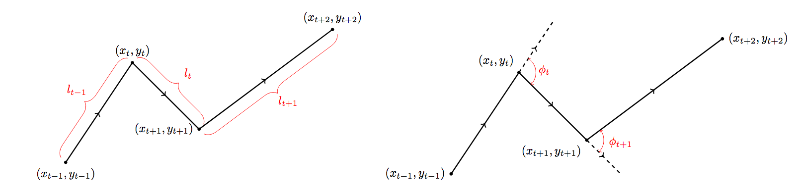

Week 13 Lab
========================================================

For lab, we're going to get some practice fitting ABC models using a dataset of a collared sheep. The [data we will be using for the problem set](https://github.com/hlynch/Bayesian2020/tree/master/_data/SheepData.csv) is a slightly modified (simplified) version of the data from the [original paper](https://github.com/hlynch/Bayesian2020/tree/master/_data/RuizSuarezEtAl2020.pdf).

I have provided a dataset of locations from a collared sheep at approximately 5 min intervals over a 2 month period. We will assume all the time intervals are the same so you can ignore the time column in the data set provided. I have provided [some code](https://github.com/hlynch/Bayesian2020/tree/master/_data/SheepDataPrep.R) to project the original geographic locations into a local (Argentinian) coordinate system with (X,Y) being measurements of location in units of meters. This code also plots the data on a map using the R function mapview(), which is an incredibly handy set of functions for displaying GIS data directly in R.

(Side note: I have also provided an alternative dataset that can be used for lab. A slightly modified version of the original data from [this paper](https://github.com/hlynch/Bayesian2020/tree/master/_data/TarrouxEtAl2020.pdf) can be found [here](https://github.com/hlynch/Bayesian2020/tree/master/_data/PetrelData.csv). Note that this dataset includes multiple animals and I suggest modelling all the animals with the same movement parameters [though each in and out track will be one foraging "bout", so you'll have to treat each "bout" as its own time series, whereas the sheep data represents one long time series for a single individual], though more complex versions of the models could of course include random effects for individual. I provide some code [here](https://github.com/hlynch/Bayesian2020/tree/master/_data/PetrelDataPrep.R) to help you read in and re-project the data.)

We will fit a relatively simple model for movement, in which the sheep advances some distance $\ell$ at each step and then turns some angle $\phi$ before moving again. 

(\#fig:unnamed-chunk-1)Visualization of movement model parameters step length and turning angle (Source: moveHMM R package vignette)

We want to use ABC to estimate the parameters of the distribution for distance and turning angle.

We will assume a half-Normal model for step length

$$
\ell \sim Norm(\mu,\sigma^{2})[0,\infty)
$$

and a von Mises distribution for turning angle $\phi$

$$
\phi \sim vonMises(\rho,\kappa)
$$

where the PDF of the von Mises distribution is given by

$$
f(\phi|\rho,\kappa) = \frac{e^{\kappa cos(\phi-\rho)}}{2\pi I_{0}(\kappa)}
$$

(Note that the von Mises is usually described in terms of $\mu$ and $\kappa$, but I have used $\rho$ instead of $\mu$ to avoid confusion with the half-Normal used for distance.) What is $I_{0}(\kappa)$? It is the modified [Bessel function](https://en.wikipedia.org/wiki/Bessel_function) of order 0. But, luckily enough, the von Mises distribution is built into the [`circular` package](https://cran.r-project.org/web/packages/circular/circular.pdf) in R, so you can use the function in that package to draw from the von Mises distribution.

Keep in mind that $\phi$ is an angle in radians and ranges from $(-\pi,\pi)$.

Your task for this problem set is to use ABC to generate posterior distributions for the four model parameters: $\mu$, $\sigma$, $\rho$, and $\kappa$.

The basic steps are:

1.	Determine priors for each of the parameters
2.	Draw from the priors
3.	Simulate a path 
4.	Compare to the data
5.	Accept/reject posterior samples
6.	Cycle back to Step 2.

You are free to determine the metric(s) of fit for the ABC. Ruiz-Suarez et al. (2020) suggest four metrics, you can use these or others. You will likely find that using multiple metrics of fit (different criteria, **all** of which would need to be satisfied to accept a set of parameters) will help narrow down your posteriors. Note also, however, that if your metric(s) of fit are too stringent, than so many samples will be rejected that it will take a very long time to get a sufficiently large sample of accepted parameters to estimate your posteriors.

Important: Your parameters are either all accepted or all rejected, so the parameter values that you draw in Step #2 “rise or fall” together. Either all of them are accepted, or none of them are.

For the problem set, provide your code, your posteriors, and a description of your metrics of fit.
