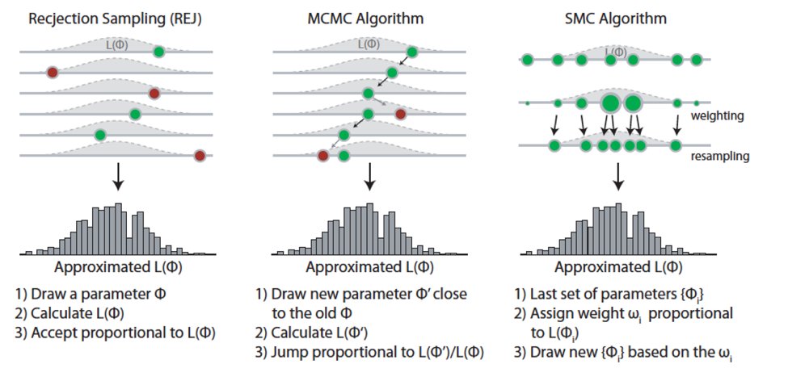

Week 13 Lecture
========================================================

Papers to read this week:

* [Beaumont 2010](https://github.com/hlynch/Bayesian2020/tree/master/_data/Beaumont2010.pdf)
* [Beaumont and Rannala 2004](https://github.com/hlynch/Bayesian2020/tree/master/_data/BeaumontRannala2004.pdf)

We will start with a quote from Beaumont 2010: "For many problems, although it may be straightforward to write a computer program to simulate data, it may actually be very difficult to work out the likelihood function."

When would we use ABC? ABC should be considered when the mechanism generating your data is so complicated that you don't have any hope of writing down an actually likelihood for it. It might be because the actual biological or physical mechanism is complicated or because the observation process is complicated - it doesn't matter. You have data and its generated by some process and you want to figure out how to estimate the parameters of that underlying process.

The basics of ABC are simple:
(1) Specify some summary metric that you think captures the fit of the model to the data. [Some references call this "D" but I like to use the symbol T since this is more traditional and it matches the symbology we used in Biometry.] In other words, how would you judge whether a model was a "good" model. Usually there are aspects of the data that you think are really important and any good model should match the data in these respects. There are also probably aspects of the data that are not as critical and you'd be satisfied with a model that missed the mark in these respects. (In a population model, for example, you might be most concerned that your model captures the interannual variability in abundance, and less concerned that the models gets the right number for abundance. In this case, the summary statistic might be interannual variation in abundance.) 

**Sufficient statistics** A little vocabulary is in order here. A sufficient statistic is a summary metric that captures all the information in the data for a given parameter. Once you calculate the sufficient statistic, you have everything you need to estimate the parameter of interest. For example, if you have data from a Poisson distribution, the sum of the data is all you need to estimate the parameter $\lambda$. (This seems obvious for this example but there are more complex examples in which the "data compression" of the summary statistic is significant.) I'm bringing this up here because sufficient statistics are always the best summary metric to use for ABC, since there is no loss of information in using the sufficient statistic to compare the simulated data to the real data. However, in many practical cases, the sufficient statistic is unknown so you have to be a bit creative when thinking of summary metrics that capture the key elements of the dataset you have. (We'll discuss this with an example in a few minutes.)

(2) Simulate the process over the space of all possible parameter values. 

(3) For each simulation, calculate the summary metric of fit. Reject the parameter combinations that did not yield a summary statistic similar to the actual data. The density of parameter values that were not rejected are left, and they form an approximate posterior distribution.

*This is remarkably straightforward! Try a bunch of parameter values and see which ones "work". Its like throwing spaghetti at the wall and seeing what sticks.

Strictly speaking, the algorithm as I have just described it is ABC-rejection sampling, because we are rejecting parameter sets that do not fit the data. Other algorithms for ABC operate more like particle filters, whereby you iterate through the ABC process but at each step you redraw new parameter sets in the vicinity of the ones that were retained at the last stage.

##A side note about summary statistics: The Mona Lisa 

Coming up with summary statistics (often called 'test' statistics) for your model can be challenging. Let's work through an example. What test statistics would you use to determine if a painting actually was the Mona Lisa? (Thanks to Stefano Allesina for the idea.)

(\#fig:unnamed-chunk-1)The Mona Lisa. Source: Wikimedia Commons

  
Click for Answer

Compare your test statistics to three “model” Mona Lisas – Were your test statistics powerful enough to reject any of the models as the real Mona Lisa?

(\#fig:unnamed-chunk-2)Fake Mona Lisa #1.

(\#fig:unnamed-chunk-3)Fake Mona Lisa #2.

(\#fig:unnamed-chunk-4)Fake Mona Lisa #3.

 

To solidify our understanding of ABC, let make sure we see the parallels between ABC and the basic rejection sampling we learned in the beginning of the semester.

**Rejection sampling**

In rejection sampling, we draw a value $x^{(i)}$ from the prior $q(x)$. [Note that at the time, we called this a candidate distribution, but it is essentially a prior distribution and so we will stick with that terminology here. The scaling constant $M$ is just there to ensure that the likelihood ratio is always $\leq 1$.] We then calculated the ratio of the likelihoods and accepted the value with a probability equal to the likelihood ratio. [Again, this is a scaled likelihood ratio because we have this arbitrary constant $M$ in the denominator. So if $M$ is really big, we reject most of the samples from the prior/candidate distribution, but they are retained \emph{in proportion} to the likelihood $p()$.]

$$
x^{(i)} \sim q(x) \\
u \sim \mbox{Unif}(0,1) \\
\mbox{u} < \frac{p(x^{(i)})}{M*q(x^{(i)})} \mbox{, then accept } x^{(i)}
$$

This works fine when we can write down the likelihood $p()$ but **what happens when we cannot write down the likelihood?** That's when ABC comes in.

Rejection ABC
------------------

Same idea as above, but we are drawing parameter(s) from a prior/candidate distribution $x^{(i)}$ and then running them through our simulation. We then accept or reject based on whether the summary metric matches that from the data.

$$
x^{(i)} \sim q(x) \\
\mbox{Simulate data using the parameter(s) } x^{(i)} \\
\mbox{if } T^{\mbox{sim}} = T^{\mbox{data}} \mbox{, then accept } x^{(i)}
$$
So...this sounds pretty straightforward, but often T is a continuous variable and it is exceptionally unlikely that your simulated statistic will yield a summary statistic T that is exactly equal to that for the real data, and so in practice, ABC goes like

$$
x^{(i)} \sim q(x) \\
\mbox{Simulate data using the parameter(s) } x^{(i)} \\
\mbox{if } \mbox{distance}(T^{\mbox{sim}},T^{\mbox{data}}) < \epsilon \mbox{, then accept } x^{(i)}
$$
Note that now we had to define some way of defining the distance between two statistics. In one dimension, when you have a single statistic, this is pretty straightforward and you could simply define

$$
\mbox{distance}(T^{\mbox{sim}},T^{\mbox{data}}) = T^{\mbox{sim}} - T^{\mbox{data}}
$$
However, when you have more than one statistic, you need to find some way to combine them. For instance, its not obvious that if you have one statistic related to mutation rate and another related to convergence time that the distance should simply be the Euclidian distance 

$$
\mbox{distance}(T^{\mbox{sim}},T^{\mbox{data}}) = \sqrt{(MR^{\mbox{sim}} - MR^{\mbox{data}})^2 + (CT^{\mbox{sim}} - CT^{\mbox{data}})^2}
$$
In fact, this measure of distance might make no sense at all. This is all to say that your choice of statistics and your choice of distance are up to you, and should be chosen carefully if your ABC algorithm is going to be able to differentiate 'good' models from 'bad' ones.

ABC comes with some challenges. In particular, how to explore parameter space if you have a large number of parameters? There are many flavors of ABC that have been developed; here I only introduce a few simple ones to give you a sense of how it goes.

##Option #1: Basic rejection ABC

The simplest option is simply draw a gazzilion points from your parameter space and try them all. You could draw these parameter sets from your prior distributions for each parameter. You can then use some rejection criteria to select those parameter sets that led to data that were "close enough" to be retained.

##Option #2: Markov Chain Monte Carlo ABC

In this method, you will have a Markov Chain of samples. I've pasted the pseudocode from Beaumont 2010 below. Note that $\pi(\theta)$ is the prior distribution for parameter $\theta$ and that $K()$ is a PDF describing jumps between values in parameter space. (This is exactly the same as we dealt with previously with we discussed Metropolis-Hastings.) Note that if the jump distribution $K()$ is symmetric, than the ratio in step 3b is equal to 1 and can be dropped.

**Pseudocode**

Initialize by sampling $\theta^{(0)} \sim \pi(\theta)$. \\
At iteration $t$, \\

1. Simulate $\theta^{\prime} \sim K(\theta|\theta^{(t-1)})$.
2. Simulate $x \sim p(x| \theta^{\prime}$).
3. If $\rho(S(x),S(y)) < \epsilon$,
\tab a. $u \sim \mbox{Unif}$(0,1);
\tab b. $\mbox{if} u \leq \pi(\theta^{\prime})/\pi(\theta^{(t-1)}) \times K(\theta^{(t-1)}|\theta^{\prime})/K(\theta^{\prime}|\theta^{(t-1)}), \mbox{then } \theta^{(t)}=\theta^{\prime}$;
\tab c. $\mbox{otherwise } \theta^{(t)} = \theta^{(t-1)}$;
4. $\mbox{otherwise } \theta^{(t)} = \theta^{(t-1)}$.

##Option #3: Sequential Monte Carlo ABC

A more sophisticated algorithm is called Sequential Monte Carlo (SMC) ABC. In SMC-ABC, each parameter combination $\theta_{i}$ is termed a "particle". If you have $m$ parameters, you can think of each parameter combination as a particle in m-dimensional space. A population of these particles can be written as $\{\theta_{1},\theta_{2},\dots,\theta_{N}\}$.

**Pseudocode**

1. A population of particles $\{\theta_{1},\theta_{2},\dots,\theta_{N}\}$ is selected  using the prior distributions for each parameter
2. The simulation/model are used to simulate data $x^{*}$ from $\{\theta\}$
3. Calculate a distance metric between $x^{*}$ and the observed data
4. Particles with distance less than some tolerance $\epsilon$ are retained
5. Retained particles are weighted and smoothed to create a distribution from which the next generation of particles will be drawn
6. Reduce the tolerance $\epsilon$ and start again at step 1
7. Keep iterating until the desired tolerance $\epsilon$ is achieved

or, more mathematically,

1. At iteration $t=1$, \\
for $i = 1,\dots,N$, \\
\tab until $\rho(S(x),S(y)) < \epsilon_{1}$ \\
\tab \tab simulate $\theta_{i}^{(1)} \sim \pi(\theta) \mbox{and} x \sim p(x|\theta_{i}^{(1)}). \\
Set $\omega_{i}^{(1)} = 1/N$. \\
Take $\tau^{2}_{2}$ as twice the empirical variance of the $\theta_{i}^{(1)}$'s.

2. At iteration $2 \leq t \leq T$, \\
for $i = 1,\dots,N$, \\
\tab until $\rho(S(x),S(y)) < \epsilon_{t}$ \\
pick $\theta_{i}^{*}$ from the $\theta_{j}^{(t-1)}$'s with probability $\omega_{j}^{(t-1)}$; \\
generate $\theta_{i}^{(t)} \sim K(\theta | \theta_{i}^{(*)};\tau_{t}^{2})$ and $x \sim p(x|\theta_{i}^{(t)})$. \\
Set $\omega_{i}^{(t)} \propto \pi(\theta_{i}^{(t)})/\sum_{j=1}^{N}\omega_{j}^{(t-1)}K(\theta_{i}^{(t)}|\theta_{i}^{(t-1)};\tau_{t}^{2}$).

Take $\tau_{t+1}^{2}$ as twice the weighted empirical variance of the $\theta_{i}^{(t)}$'s.

(\#fig:unnamed-chunk-5)Visualization of the alternative sampling options: Rejection Sampling, MCMC, and SMC.

##Drawbacks to ABC

While ABC has several appealing features, and forces us to articulate precisely what a "good" model would like like, keep in mind that the samples we keep in our posterior are not draws from the exact posterior distribution $p(\theta|y)$ but rather from $p(\theta|d(\tilde{y},y) \leq \epsilon)$. This becomes a good approximation to the true likelihood if $\epsilon$ is very small, but $\epsilon \rightarrow 0$ carries computational costs. So ABC involves a careful balence between accuracy and speed.

For more information about this week's topic
------------------------

* [Hertig et al. 2011](https://github.com/hlynch/Bayesian2020/tree/master/_data/HartigEtAl2011.pdf)
* [McKinley et al. 2017](https://github.com/hlynch/Bayesian2020/tree/master/_data/McKinleyEtAl2017.pdf)
* [Scranton et al. 2014](https://github.com/hlynch/Bayesian2020/tree/master/_data/ScrantonEtAl2014.pdf)
* [Sunnaker et al. 2013](https://github.com/hlynch/Bayesian2020/tree/master/_data/SunnakerEtAl2013.pdf)
* [Toni and Stumpf 2010](https://github.com/hlynch/Bayesian2020/tree/master/_data/ToniStumpf2010.pdf)
