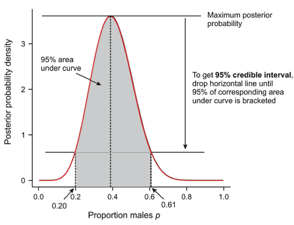
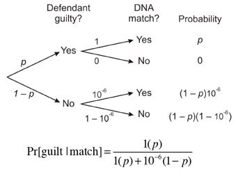

Week 2 Lecture
========================================================

Papers to read this week:

* [Ellison 1996](https://github.com/hlynch/Bayesian2020/tree/master/_data/Ellison1996.pdf)
* [Ellison 2004](https://github.com/hlynch/Bayesian2020/tree/master/_data/Ellison2004.pdf): More advanced material that may take a few weeks to sink in
* [Berger and Berry 1988](https://github.com/hlynch/Bayesian2020/tree/master/_data/BergerBerry1988.pdf): This is a repeat from Biometry but worth refreshing even if you took Biometry recently and required reading for those that did not take Biometry.

This week we will review the basic elements of Bayesian inference, building on our introduction to Bayes Theorem last week.

Everyone was asked to watch [this video](http://www.sumsar.net/blog/2017/02/introduction-to-bayesian-data-analysis-part-one/) before lecture today. I think this video does a particularly nice job explaining the basic ideas underlying Bayesian inference, and having that intuition under your belt will help when we get into the math.

At the end of this video, you got a brief introduction to Approximate Bayesian Computation. I'll introduce a few highlights here, since doing so makes Bayesian analysis very intuitive, but we'll reserve a more complete discussion for Week #15. 

Bayes Theorem and all that follows from it
---------------------

We start with Bayes theorem (here I am following the notation of Ellison [1996]):

$$
P(\theta|x) = \frac{P(x|\theta)P(\theta)}{P(x)}
$$
or, as it is more commonly written,

$$
P(\theta|x) \propto P(x|\theta)P(\theta)
$$

In other words, the posterior probability distribution for the parameter $\theta$ conditional on the data $x$ is proportional to the likelihood P(x|$\theta$) times the prior distribution $P(\theta)$. We can think about this (vis a vis the video we just saw) as the likelihood "filtering out" the prior distribution. In other words, we have some distribution that describes our prior understanding of the parameter, and we use the data to sift through which values make more or less sense. Values that make the data more likely are themselves more likely, and vice versa. 

Next week we will focus on prior distributions and their interpretation, so we won’t say much more about prior distributions at this stage. We will however work through the algebra of Bayes Theorem to see how we obtain a posterior distribution.

Let’s say we have one observation $y$ from a Normal distribution of unknown mean $\mu$ and known variance $\sigma^{2}$. The likelihood of obtaining that observation is simply:

$$
P(y|\mu) \propto exp\left(\frac{-(y-\mu)^{2}}{2\sigma^2}\right)
$$
where I have included only the terms involving the unknown parameter $\mu$. Note that I have not included $\sigma$ after the conditional "|" because I want to emphasize that only $\mu$ is unknown.

(Side note on notation. By tradition, both probability densities and likelihoods have the data on the left side and the parameters on the right side on the conditional "|". This is not how I originally introduced them last week, because in Week #1's lecture I was trying to highlight the differences between PDFs and likelihoods, which involves what is known and what is unknown. However, to be consistent with the book and papers on the subject, here I revert back to the traditional notation where the data "y" is on the left hand side. Also, I use the letters $x$ and $y$ interchangeably so my choice of one or the other to represent data is arbitrary.)

Let’s assume a fairly broad (i.e. large variance) Normal distribution prior for $\mu$, $N(\mu_{0},\tau^{2})$, so that:

$$
P(\mu) \propto exp\left(\frac{-(\mu-\mu_{0})^{2}}{2\tau^2}\right)
$$

Make sure this distribution makes sense. **In this case, the distribution is on $\mu$** and its parameters are $\mu_{0}$ and $\tau$. (We are not used to thinking about parameters as having distributions. In frequentist statistics, $\mu$ is considered a fixed quantity, but here and throughout the semester, we will assume that all quantities, including parameters, are random variables described by a probability density function.)

The posterior distribution is now given by the product:

$$
P(\mu|y) \propto exp\left(\frac{-(y-\mu)^{2}}{2\sigma^2}\right)exp\left(\frac{-(\mu-\mu_{0})^{2}}{2\tau^2}\right)
$$
$$
P(\mu|y) \propto exp\left(-\frac{1}{2}\left(\frac{(y-\mu)^{2}}{\sigma^2}+\frac{(\mu-\mu_{0})^{2}}{\tau^2}\right)\right)
$$
I’ll spare you the algebra, but this can be simplified as:

$$
P(\mu|y) \propto exp\left(-\frac{1}{2}\frac{(\mu-V\nu)^{2}}{V}\right)
$$
where,

$$
\frac{1}{V} = \frac{1}{\sigma^2}+\frac{1}{\tau^2}
$$
and,

$$
\nu = \frac{y}{\sigma^2}+\frac{\mu_{0}}{\tau^2}
$$
While this expression looks kind of messy, in the limits it makes a lot of sense:

$$
lim_{\tau \rightarrow \infty} V\nu \rightarrow \frac{y/\sigma^2}{1/\sigma^2} = y
$$
In other words, the mean of the posterior distribution is just the value of the single data point if the prior is so broad as to contribute no information to the posterior. 

**Question: What is $lim_{\tau \rightarrow 0} V\nu$?**

  
Click for Answer

In this case,

$V \rightarrow \tau^2$

$\nu \rightarrow \frac{\mu_{0}}{\tau^2}$

Therefore, $V\nu \rightarrow \mu_{0}$.

&nbsp;

Likewise, in the $lim_{\tau \rightarrow \infty} V \rightarrow \frac{1}{1/\sigma^2} = \sigma^2$

which is just the known variance for the data’s distribution. (This should make some sense keeping in mind that the posterior variance represents the uncertainty on the posterior mean. If we consider the central limit theorem (CLT), we know that the standard error of the mean is given by $\sigma/\sqrt{n}$ but in this case $n=1$ so this is exactly what we would expect.)

What happens if we have $n > 1$ independent observations?

In this case the likelihood is a product:

$$
P(y|\mu) \propto \prod_{i=1}^{N}exp\left(-\frac{(y_{i}-\mu)^2}{2\sigma^2}\right) = exp\left(-\frac{1}{2\sigma^2}\sum_{i=1}^{N}(y_{i}-\mu)^2\right)
$$

Working through the same algebra, we have the same basic form for the posterior distribution:

$$
P(\mu|y) \propto exp\left(-\frac{1}{2}\frac{(\mu-V\nu)^2}{V}\right)
$$
except now,

$$
\frac{1}{V} = \frac{n}{\sigma^2}+\frac{1}{\tau^2}
$$
and,

$$
\nu = \frac{n\bar{y}}{\sigma^2}+\frac{\mu_{0}}{\tau^2}
$$
(Why do we only keep track of the posterior up to a proportion? Since we know the posterior has to integrate to 1 [not withstanding the use of an “improper” prior, more on that next week], we can always work out the constant if we needed. In practice, however, we usually use Monte Carlo methods to draw samples from the posterior and, for reasons we will discuss in a few weeks, this only requires knowledge of the posterior up to within a proportionality constant.)

You can see that as $n$ gets large, the data will start to dominate the prior. In fact:

$$
lim_{n \rightarrow \infty} V\nu \rightarrow \frac{\frac{n\bar{y}}{\sigma^2}}{\frac{n}{\sigma^2}} = \bar{y}
$$

Once again, this is precisely what we would expect under the CLT. 

In general, we can see from this fairly simply case with Normal distributions that the posterior is a **weighted average of the prior and the likelihood**, with the weights determined by the variances $\sigma^2$ and $\tau^2$ and the sample size. **Larger sample size weights the likelihood more strongly than the prior.** What happens if $\tau^2$ is very very small? In this case, the prior dominates the posterior entirely, irrespective of the data. This is a good reminder that you want the prior to have reasonable support (non-negligible density) for all values that you think might be supported by the likelihood, because this will allow the posterior to shift and bend towards the likelihood as more data is used.

What if the variance $\sigma^2$ was not assumed known? Then we would have to include a prior for $\sigma^2$ as well.  In this case, the joint posterior distribution would be given as:

$$
P(\mu,\sigma|y) \propto P(y|\mu,\sigma)P(\mu)P(\sigma)
$$
If we wanted the marginal posterior distribution for $\mu$, then we would need to integrate out $\sigma$:

$$
P(\mu|y) = \int P(\mu,\sigma|y)d\sigma
$$

## How do we interpret the posteriors?

Whereas frequentist methods are focused on rejecting a null hypothesis, Bayesian analyses are focused on the posterior distribution as a statement of the probability of the parameter lying within a certain interval (for a continuous parameter). Bayesian methods often (but not always) end with a statement about the mean (sometimes median) of the posterior distribution and some interval around that measure of central tendency. 

Its worth reminding ourselves that there are three measures of central tendancy that we might want to use to describe the posterior distribution. While the **mean** is perhaps most common, it is not unusual in Bayesian analyses to report instead the **median** or the **mode**; it often depends on which measure of central tendency you think is the most biologically relevant. We can also use the posterior distribution to answer other questions about the parameter(s) of interest. For example, if we wanted to know, "What is the probability that $\mu$ is positive?" then all we need to do is integrate the posterior distribution from 0 to $\infty$. That yields a direct and easily interpreted probability, and allows us to easily test a wider variety of hypotheses than was easy accomplished with a frequentist approach.

We define a 100(1-$\alpha$)$\%$ credible interval for a parameter $\theta$ as: 

$$
P(\theta \in B_{X}|X) = 1 - \alpha
$$
where $B_{X}$ is some interval. In the discussion to follow I will assume 100(1-$\alpha$)$\%$ equals 95$\%$, but this is only because it makes the discussion more intuitive and not because there is anything magical about $\alpha$=0.05.

There are an infinite number of intervals that would contain 95$\%$ of the area under the curve (i.e. the pdf of the posterior), and so there are an infinite number of 95th percentile credible intervals (heretofore, CI). One possibility is to make sure there is 2.5$\%$ in each tail (the “central” CI). Another is to find the shortest interval that contains 95$\%$ of the probability. This latter interval is called the highest posterior density interval or HDPI. Calculation of the HDPI can be quite difficult, especially because we often lack an analytical form for the posterior, so often the central CI is used instead.

(\#fig:unnamed-chunk-1)Source: Doug Schluter [link](https://www.zoology.ubc.ca/biol548/lecturepdf/09.Bayes.pdf)

Note that while summary statistics are useful, it is often the case that authors will publish a histogram of the entire posterior distribution. This can be particularly valuable if the posterior is highly skew (or even multimodal).

## A slight detour, to get us thinking about the basic philosophy behind Bayesian stats

For lecture today I provided an article (below) by Fenton and Neil (2012) and the accompanying article from the Guardian.

The basic story at hand: Convicted killer “T” appealed his conviction, which was based in part on a Bayesian analysis that found strong evidence linking his sneakers (found in his home) to a shoeprint at the crime scene. A judge threw out “T”s conviction on the basis that Bayesian statistics (specifically, expert opinion that had been used to generate a prior distribution for the number of sneakers of that type in the UK at the time) was not “firm” statistics. The court went further and basically rejected the use of Bayesian statistics in all cases except (somewhat arbitrarily, in my opinion) in the analysis of DNA evidence. 

Fortunately, Bayesian statisticians have come to its defense noting, for example, “The fact that variables cannot be precisely expressed does not affect the validity of the relationships described by [Bayes] formula”.

A few questions that were raised in Fenton and Neil (2012):

**1) When is it OK to multiply likelihoods? Why was the practice of multiplying likelihoods (or likelihood ratios, equivalently in this case) criticized in the original court case?**

  
Click for Answer

Multiplying probability/likleihoods is the **correct** thing to do **if** the traits being discussed are independent. However, many physical traits used in forensic analyses are not, in fact, independent (e.g., height and weight). When the traits being discussed are not independent, then it is incorrect to calculate the joint probability as the product of the probabilities for each trait.

 

**2) Why is a 1 in 10,000 fingerprint match not necessarily strong evidence that the accused was at the scene? (Hint: Can you ever accept the null hypothesis? What is the null hypothesis in this case? Why does it matter?)**

  
Click for Answer

(\#fig:unnamed-chunk-2)Source: Doug Schluter [link](https://www.zoology.ubc.ca/biol548/lecturepdf/09.Bayes.pdf)

Note that if p=$10^{-6}$, then $P(\mbox{guilt}|\mbox{match})$=0.5. If p=$0.5$, then $P(\mbox{guilt}|\mbox{match})$=0.999999. So, your decision about the guilt or innocence of the defendent depends a lot on your prior expectations for their guilt or innocence.

 

&nbsp;

Fenton and Neil raise the idea of a Bayesian network, which we will return to briefly next week. A Bayesian network is a graphical model that shows the conditional relations among variables, and is just a more visual way of understanding a Bayesian analysis with many conditional relationships. 

## Getting some more practice with JAGS

We don’t have a formal lab this week, but we can use McCarthy’s example in Boxes 3.4 and 3.5 to practice running models in JAGS. This also gives us an opportunity to see how Bayesian models align with frequentist approaches we may be more familiar with.

**EXERCISE #1**: Run the code from McCarthy Box 3.4, which fits the following model:

$$
\#Trees \sim Pois(\mbox{mean density})
$$
for the number of trees recorded in equal sized quadrats. First, use the prior and starting values suggested by McCarthy. Then try and break JAGS – use other prior distributions and wildly different starting values. Do the starting values influence the time to convergence? (Look at the posterior draws...)

**EXERCISE #2**: Compare the result obtained using JAGS to that obtained in a frequentist analysis using the R function ‘glm’. Are they the same? Why or why not? Does it depend on the prior?

**EXERCISE #3**: Add the extra variation as described in Box 3.5.

10 pt BONUS (turn in with problem set): Compare the result obtained using JAGS (from Exercise #3) to that obtained in a frequentist random effects analysis using the R function ‘glmer’. (Nominally, the Poisson model with extra variation is just a random effects model.) 

a) Is your glmer model actually equivalent to the JAGS model? If its different, how so? 
b) How do you compare the output of glmer with that of JAGS? How do we even know whether they yield the same inference?
c) How do you calculate the variance of the random effect as output by glmer?

For more information about this week's topic
------------------------

Both of the articles below discuss the use of Bayesian methods in the criminal justice system:

* [Fenton and Neil 2012](https://github.com/hlynch/Bayesian2020/tree/master/_data/FentonNeil2012.pdf)
* [A formula for justice in $\textit{The Guardian}$](https://github.com/hlynch/Bayesian2020/tree/master/_data/TheGuardian.pdf)
