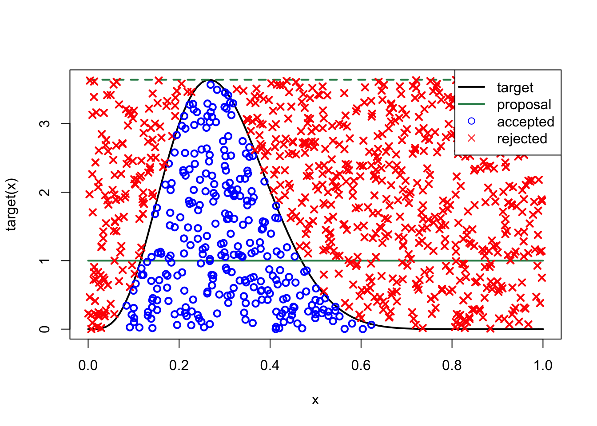

Week 4 Lecture
========================================================

Papers to read this week:

* [Lunn et al. Section 1.4](https://github.com/hlynch/Bayesian2020/tree/master/_data/Lunn1.4.pdf)
* [Robert and Casella Lecture Notes](https://github.com/hlynch/Bayesian2020/tree/master/_data/MCMC-UseR.pdf): For the purpose of this week, focus on pages 51-79 but these lecture notes are excellent and cover a lot of material and are worth skimming through in their entirety in case there are other sections of interest.
* [Smith and Gelfand 1992](https://github.com/hlynch/Bayesian2020/tree/master/_data/SmithGelfand1992.pdf): **Important**: This paper has a typo, an important one. See if you can find it. (The paper is such an important one, and so nicely explains the underlying principles, so we read this paper anyways...) In any case, we'll discuss it in class.

##Conjugacy aside, how to actually calculate the posterior

Over the last couple of weeks we've learned about Bayes theorem, and how the posterior integrates information from the data (through the likelihood) and the prior. We also introduced the idea of conjugate pairs, whereby for a given likelihood distribution, there is often a choice of prior (specifically, a choice for the distribution used) that leads to a posterior of the same form. These conjugate pairs make calculating the posterior simple. However, real problems are never quite that simple, and inevitably we need to use numerical methods to figure out what the posterior distribution is.

Why are we talking about sampling methods? Why do we need them in Bayesian statistics? - because the posterior distribution may have no straightforward analytical form! In most cases, we have no way of either writing down the posterior PDF or of sampling directly from it. Sampling methods (of which there are many) provide a mechanism to sample from the posterior distribution even if we cannot write it down. There are several methods we will discuss. Which ones you actually use in each situation depend on your needs for efficiency vs. simplicity. JAGS will automatically choose the best method, but a proper understanding of Bayesian statistics requires a thorough understanding of MC (even though, sadly, most ecologists use JAGS without this background...)

Before we dive headlong into Monte Carlo methods, I want to start with an approach that is almost too simple.  Let's start by going back to the core equation of Bayesian methods

$$
\mbox{posterior} \propto \mbox{likelihood} \times \mbox{prior}
$$
What if we just sampled from the prior and put those sampled values into the likelihood? To illustrate I'm going to re-fit the model from McCarthy's Box 3.4 (which we have used before to practice running models in JAGS). In the code below, I sample from a prior for $\lambda$ (in this case, a more informative but still broad prior than McCarthy used), I then take those values and calculate the likelihood of obtaining the data for each of those values of $\lambda$, and then I multiply the likleihood and prior together. Note that to avoid numerical issues, I have summed the logged distributions and then taken the exponential at the end.


```r
prior<-rlnorm(1000,1,1)
data<-c(6,0,1,2,1,7,1,5,2,0)

logged.posterior<-c()
for (i in 1:length(prior))
{
  logged.posterior<-c(logged.posterior,sum(dpois(data,lambda=prior[i],log=T))+dlnorm(prior[i],1,1,log=T))
}
plot(prior,exp(logged.posterior),xlim=c(0,5))
```


Ta-da! The posterior distribution is peaked at around $\lambda=2.5$, just like it should since the mean number of trees in the dataset is 2.5. (Note that this is the un-normalized posterior.) You can go back and play around with different values of the prior. What happens if you use a highly uninformative prior? Does that make sampling harder? Why?

This seems so simple, why would we ever use another method? When you have many more parameters, it turns out that this approach is numerically inefficient, because you are trying a lot of values for the parameters that have very low likelihoods and contribute little to the posterior. But as we wade into methods that seek the same result (more efficiently), we should keeop in mind the simplicity of this basic method.

##Monte Carlo Methods
In Week #4 and #5, we take a detour from Bayesian stats itself to discuss a more general concept, which is Monte Carlo methods. Monte Carlo methods are named for the famous gambling city, which remind us that stochasticity is really the only requirement for something to be considered “Monte Carlo”. Monte Carlo methods, and the idea behind Markov Chain Monte Carlo (MCMC), are much more general than just Bayesian statistics and, in fact, arise in frequentist statistics as well.

I’ll introduce Monte Carlo methods using three common applications:

1) Rejection sampling
2) Monte Carlo Integration
3) Importance Sampling

Next week, we will tackle Markov Chain Monte Carlo Methods, such as Gibbs Sampling and Metropolis-Hastings. (Markov Chain Monte Carlo is a special case of Monte Carlo in which the next sample from the distribution depends only on the last sample [or, in more complex cases, on a finite number of previous samples]. I will tend to use the term “MCMC” when talking about these methods as applied to Bayesian statistics, because most of the methods used in Bayesian statistics have the Markov property, but keep in mind that MCMC is really a special case of a much more general concept of “Monte Carlo”.)

##Rejection Sampling

The idea behind rejection sampling is pretty straightforward and best illustrated with a geometric example. Assume for a moment that you want to sample points within the unit circle (at right) but you only have a machine that can sample from the Uniform(0,1) distribution. What do you do? You could sample X and Y from the Unif(0,1), which will give you a random assortment of locations (X,Y) within the white square. For each pair of points (defining a location $[x_i, y_i]$) you can test whether it falls inside the unit circle (by checking that ) or outside. If you simply reject all pairs $(x,y)$ that fall outside the unit circle, you are left with a random sample of points within the unit circle. (This is probably what you did to solve the Week #1 Problem Set.) This is just as good as having a function to sample from the unit circle directly except now it is less efficient because you have had to draw more points than you needed (because some were rejected). In this case, the loss of efficiency was rather trivial, but you can imagine having drawn X and Y from Unif(-1000,1000) and using rejection sampling to get points within the unit circle. In this case, the loss of efficiency would be rather extreme. 

<div class="figure" style="text-align: center">

<p class="caption">(\#fig:unnamed-chunk-2)Probability is uniform within the unit circle.</p>
</div>

Now that we have the basic picture, we can see how this might apply to a real problem. Rejection sampling is based on the idea that you may not be able to draw from the distribution you really want, but you can sample from a distribution that includes (in a statistical sense) the distribution you want and reject samples accordingly.

Assume $g(x)$ is the distribution you would like to draw from – we call this the “target distribution”. The basic idea is that you take a distribution $f(x)$ that you **can** sample from (we call this the “candidate distribution” because it generate candidates for the accept-reject part; sometimes this is also called the "proposal distribution" because it is the distribution used to propose samples that are either rejected or accepted), and you scale it by some number M so that you guarantee that $M*f(x)$ is always greater than or equal to $g(x)$. (NB: The more traditional letters for the target and candidate distributions are p() and q() but here I am using f() and g() to be consistent with the notes that follow. As might be understood by now, the actual letters used is irrelevant, but I'll try and keep everything consistent to minimize confusion.)

What is M? You want M to be only as large as it needs to be (Why?), so we calculate M as

$$
M = sup_{x}\left(\frac{g(x)}{f(x)}\right)
$$
or, to look at it another way

$$
1 = sup_{x}\left(\frac{g(x)}{M*f(x)}\right)
$$

In words, this simply says that the **largest** you would want $g(x)/M*f(x)$ to be is 1.

OK, so now let’s assume that you have figured out what $M$ needs to be. The pseudocode lays out the basic algorithm to draw N samples from the target distribution:

<div class="figure" style="text-align: center">

<p class="caption">(\#fig:unnamed-chunk-3)Pseudocode for the rejection sampling.</p>
</div>

Note that the draw from the uniform is just a mechanism for accepting values from the target distribution with probability $g(x)/M*f(x)$. If it makes more sense, you could use a draw from the Bernoulli instead, i.e.

$$
x^{(i)} \sim f(x) \\
\mbox{if rBinom} \left(1,\frac{g(x)}{M*f(x)}\right)
$$

The analogy I might use is that of carving out a sandcastle from a pile of sand. The first task is to pile up enough sand that the pile is higher than the tallest part of the castle, and then the second task is to carve away at the sand until you get the shape you want. Rejection sampling is just carving away at the big shapeless pile of sand to get the distribution you wanted in the first place.

To walk through a simple example, I've bottowed a nice example nearly verbatim from Jarad Neimi's [blog](https://www.jarad.me/teaching/2013/10/03/rejection-sampling) where we take the Beta distribution as the target we want to sample from (pretending, for a moment, that this is not in base R) and the Unif(0,1) as the candidate distribution we actually can sample from. So in this example, and using the notation above, g(x) is the Beta distribution and f(x) is the Uniform distribution.


```r
a = 5
b = 12
target = function(x) dbeta(x,a,b)
proposal = dunif
```

Now we will calculate M and the probability of acceptance.


```r
mode = (a-1)/(a+b-2)
M = target(mode)
1/M
```

```
## [1] 0.2745091
```

```r
n = 1000
points = runif(n)
uniforms = runif(n)
accept = uniforms < (target(points)/(M*proposal(points)))
```

The plot below has target (red) and proposal (green) density as well as the proposal density scaled by M (green, dashed) to show how it creates an envelope over the target. The points are accepted (blue circle) and rejected (red x) values on the x-axis with their associated uniform draws on the y-axis.


```r
curve(target, lwd=2)
curve(proposal, add=TRUE, col="seagreen", lwd=2)
curve(M*proposal(x), add=TRUE, col="seagreen", lty=2, lwd=2)
points(points, M*uniforms, pch=ifelse(accept,1,4), col=ifelse(accept,"blue","red"), lwd=2)
legend("topright", c("target","proposal","accepted","rejected"), 
       lwd=c(2,2,NA,NA), col=c("black","seagreen","blue","red"),
       pch=c(NA,NA,1,4), bg="white") 
```



We will write some code in lab to actually practice doing this.

##Adaptive Rejection Sampling

I won’t say much about adaptive rejections sampling, except to say that it tunes the candidate distribution over time to increase the acceptance ratio and speed up the sampling.

##Monte Carlo Integration

The idea behind Monte Carlo integration is very simple. Let’s say you have a probability distribution f(x) and you want to know the E[X]. If you knew the pdf analytically, you could simply calculate the expectation as follows:

$$
E[X] = \int_{-\infty}^{\infty} xf(x)dx
$$
But what do you do if you don’t know the equation for $f(x)$ but you do have some way of sampling from $f(x)$? (in other words, some black box method for generating random draws ${x_{1},x_{2},x_{3},...,x_{T}}$, but no idea what’s in the black box...) In this case, you can estimate the expectation by

$$
E[X] \approx \frac{1}{T}\sum_{t=1}^{T}x_{t}
$$

Remember that the expected value E[X] is simply the value you would expect if you sampled from $f(x)$. The expected value is just the mean of all values from $f(x)$, in which case you can simply use the draws that you have in lieu of having the full pdf describing $f(x)$.

This can be extended for an arbitrarily complex function $g(x)$, so that

$$
E[g(X)] = \int_{-\infty}^{\infty}g(x)f(x)dx
$$
is approximated by

$$
E[X] = \int_{-\infty}^{\infty} xf(x)dx
$$
$$
E[g(X)] \approx \frac{1}{T}\sum_{t=1}^{T}g(x_{t})
$$
Notice that this is really no more complicated, its simply saying that you draw from $f(x)$, plug those values into $g()$ and then average all those values of $g(x)$!

How good is this estimate?

$$
SE_{E[g(x)]} = \sqrt{\frac{s^{2}_{g(x)}}{T}}
$$
where $s^{2}_{g(x)}$ is the sample variance of $g(X)$

$$
s^{2}_{g(x)} = \frac{1}{T-1}\sum^{T}_{1}(g(x_{t})-E[g(x)])^2
$$
(This is closely tied to some of the ideas we discussed in Biometry regarding bootstrap sampling. The basic idea is the same: Samples from $f(x)$ can be used in lieu of $f(x)$ for approximations of quantities involving $f(x)$. The quality of those approximations increases as the number of samples used increases.)

##Sometimes you just want the integral...

So far, we've been focused on using MC integration to calculate an expected value, but really it is a more general strategy for calculating an integral. Let's say we want to know the integral of some function over the interval $[a,b)$.

We can use the $Unif(a,b)$ distribution to help us, by using it for $f(x)$ in the equation above, i.e. as the distribution we can draw easily from. To see that, lets re-write the initial integral as

$$
\int^{b}_{a}g(x)\frac{(b-a)}{(b-a)}dx = (b-a)\int^{b}_{a}g(x)\frac{1}{(b-a)}dx = (b-a)\int^{b}_{a}g(x)f(x)dx
$$
The last version here looks like what we had up above. So we now draw from $f(x)=Unif(a,b)$ and plug those draws into our function $g(x)$

$$
(b-a)\left[\frac{1}{N}\sum^{N}_{t=1}g(x_{t})\right] = \sum^{N}_{t=1}g(x_{t}) \times \frac{(b-a)}{N}
$$
I've re-written this on the right hand side because it connects it to the geometric interpretation illustrated in the figure.

<div class="figure" style="text-align: center">

<p class="caption">(\#fig:unnamed-chunk-7)The left hand figure is just the Riemann sum version of integration. The right hand side is what we are essentially doing with Monte Carlo integration. Instead of drawing equal spaced boxes along the x-axis, we are sampling values along the x axes from a uniform distribution and then using those values to calculate the function $g(x)$. Figure adapted from Jarosz (2008).</p>
</div>

Note that the term Monte Carlo Integration is sometimes replaced by, or used synonymously with the phrase Monte Carlo simulation. Don’t let this confuse you. The idea behind both of these terms is simply that you can replace a probability distribution function (which may be a conditional probability distribution) with samples from that probability distribution function.

In one-dimension, this all seems rather too simple to be of any use, but in multi-dimensional problems, these methods are essential. The reason is that if you have $T$ multidimensional draws from $f(\vec{X})$ (where I am using vector notation explicitly to denote the fact that each draw contains $>1$ element), then you can make inference about any particular component by using the draws for that component **completely ignoring the other components**. Why does this work? Because the draws from the multidimensional distribution “average out” (heuristically speaking) the other components which might be related. In other words, to the extent that the pdf involves correlations among components, the draws from the multidimensional distribution reflect those underlying correlations already, and you can use the marginal distributions directly without concern for the multidimensionality of it. (Why this is so exciting will become clearer as we get into more detailed Bayesian examples...)

We will play around this this in lab as well.

##Importance Sampling

Importance sampling is similar to MC integration, and uses a bit of a trick to get from a distribution you can’t easily sample from, to one you can.

Let’s say that $g(x)$ above is a distribution that you cannot easily sample from. You can get around this problem by finding a similar distribution that you can sample from, using

$$
g(x) = f(x)\frac{g(x)}{f(x)}
$$
What have we gained? Well, what we can do is sample from $f(x)$ and weight these draws by the ratio $\frac{g(x)}{f(x)}$.

Now we can get E[X] (or, similarly, the E[g(x)]), by drawing from $f(x)$ to get a chain of values $x_{i}$ and calculating

$$
\frac{1}{n}\sum^{n}_{i=1}x_{i}\frac{g(x_{i})}{f(x_{i})}
$$
How useful is this method? The challenge here is in finding a good distribution $f(x)$ that has sufficient probability over the range that is important for g(x), but you don’t want something so “flat” that you end up sampling a lot of x values that don’t really contribute to the expected value of interest.

##Sampling Importance Resampling

Notice that in the above discussion of Importance Sampling, I only showed you how to use the Importance Ratios to calculate expectations, but we didn’t actually discuss how to use this method to get samples from the distribution itself. This procedure is called Sampling Importance Resampling, and we will go over it and the discussion by Smith and Gelfand (1992) in lab.
